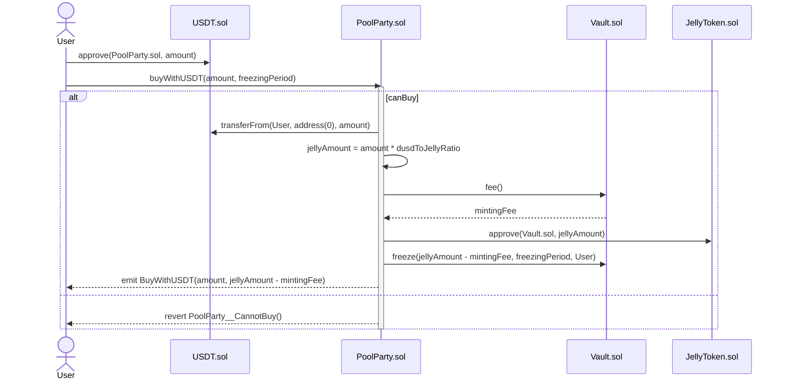
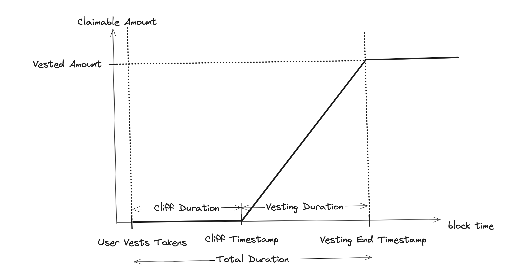

# Jelly Verse contracts

## Getting Started

This project combines Hardhat and Foundry.

### Prerequisites

Be sure to have installed the following

- [Git](https://git-scm.com/book/en/v2/Getting-Started-Installing-Git)
- [Current LTS Node.js version](https://nodejs.org/en/about/releases/)

### Build & Compile

1. Clone the repo

```shell
git clone git@github.com:MVPWorkshop/jelly-verse-contracts.git && cd jelly-verse-contracts
```

2. Install packages

```shell
npm install
```

3. Install [Foundry](https://book.getfoundry.sh/getting-started/installation)

```shell
curl -L https://foundry.paradigm.xyz | bash
foundryup
```

4. Compile contracts

```shell
npx hardhat compile
```

[Optionally]

```shell
forge build
```

5. Run tests

```shell
npx hardhat test
```

6. Run invariant tests

```shell
forge test
```

7. Get storage layout of contract

```shell
forge inspect --pretty ContractName storage
```

8. Get coverage

```shell
npx hardhat coverage
```

[For Chest]

```shell
forge coverage
```

## Smart contracts scope

This project consists of the following smart contracts:

- [JellyToken](./contracts/JellyToken.sol)
- [JellyTokenDeployer](./contracts/JellyTokenDeployer.sol)
- [JellyGovernor](./contracts/JellyGovernor.sol)
- [Governor](./contracts/Governor.sol)
- [GovernorVotes](./contracts/GovernorVotes.sol)
- [JellyTimelock](./contracts/JellyTimelock.sol)
- [Chest](./contracts/Chest.sol)
- [Minter](./contracts/Minter.sol)
- [PoolParty](./contracts/PoolParty.sol)
- [OfficialPoolsRegister](./contracts/OfficialPoolsRegister.sol)
- [TeamDistribution](./contracts/TeamDistribution.sol)
- [InvestorDistribution](./contracts/InvestorDistribution.sol)
- [LiquidityRewardDistribution](./contracts/LiquidityRewardDistribution.sol)
- [StakingRewardDistribution](./contracts/StakingRewardDistribution.sol)
- [RewardVesting](./contracts/RewardVesting.sol)
- [DailySnapshot](./contracts/DailySnapshot.sol)

## Roles & Ownership

### Roles

| Role                | Contract      | Description                                                                                                    |
| ------------------- | ------------- | -------------------------------------------------------------------------------------------------------------- |
| MINTER              | JellyToken    | Enables designated addresses to mint new tokens. Initially, the Minter contract is granted this role.          |
| DEFAULT_ADMIN_ROLE  | JellyToken    | Grants full administrative privileges, which are transferred to the Timelock after deployment.                 |
| TIMELOCK_ADMIN_ROLE | JellyTimelock | Manages operations within the Timelock contract. The deployer renounces this role post-deployment.             |
| PROPOSER_ROLE       | JellyTimelock | Allows any holder to propose actions within the governance framework. Set to address(0) so anyone can propose. |
| EXECUTOR_ROLE       | JellyTimelock | Permits the execution of approved proposals after the timelock delay. Assigned to the JellyGovernor.           |
| CANCELLER_ROLE      | JellyTimelock | Enables the cancellation of operation. Assigned to the JellyGovernor.                                          |

### Ownership

| Contract                    | Owned by | Description |
| --------------------------- | -------- | ----------- |
| Chest                       | Timelock |             |
| Minter                      | Timelock |             |
| PoolParty                   | Timelock |             |
| OfficialPoolsRegister       | Timelock |             |
| TeamDistribution            | Deployer |             |
| InvestorDistribution        | Deployer |             |
| LiquidityRewardDistribution | Timelock |             |
| StakingRewardDistribution   | Timelock |             |
| DailySnapshot               | Timelock |             |

## JellyToken.sol

### Contract Overview

JELLY serves as the primary governance and utility token for the Jellyverse ecosystem.

### Dependencies

**Inherits:**
[AccessControl](/contracts/vendor/openzeppelin/v4.9.0/access/AccessControl.sol), [ReentrancyGuard](/contracts/vendor/openzeppelin/v4.9.0/security/ReentrancyGuard.sol)

### Constants

#### MINTER_ROLE

```solidity
bytes32 constant MINTER_ROLE;
```

#### \_cap

```solidity
uint256 private immutable _cap;
```

### Storage Layout

| Name           | Type                                              | Slot | Offset | Bytes | Contract                            |
| -------------- | ------------------------------------------------- | ---- | ------ | ----- | ----------------------------------- |
| \_balances     | mapping(address => uint256)                       | 0    | 0      | 32    | contracts/JellyToken.sol:JellyToken |
| \_allowances   | mapping(address => mapping(address => uint256))   | 1    | 0      | 32    | contracts/JellyToken.sol:JellyToken |
| \_totalSupply  | uint256                                           | 2    | 0      | 32    | contracts/JellyToken.sol:JellyToken |
| \_name         | string                                            | 3    | 0      | 32    | contracts/JellyToken.sol:JellyToken |
| \_symbol       | string                                            | 4    | 0      | 32    | contracts/JellyToken.sol:JellyToken |
| \_roles        | mapping(bytes32 => struct AccessControl.RoleData) | 5    | 0      | 32    | contracts/JellyToken.sol:JellyToken |
| \_status       | uint256                                           | 6    | 0      | 32    | contracts/JellyToken.sol:JellyToken |
| \_burnedSupply | uint256                                           | 7    | 0      | 32    | contracts/JellyToken.sol:JellyToken |
| \_preminted    | bool                                              | 8    | 0      | 1     | contracts/JellyToken.sol:JellyToken |

### Functions

#### onlyOnce

```solidity
modifier onlyOnce();
```

#### constructor

```solidity
constructor(address _defaultAdminRole) ERC20("Jelly Token", "JLY");
```

#### premint

```solidity
function premint(
        address _vestingTeam,
        address _vestingInvestor,
        address _allocator,
        address _minterContract
    ) external
      onlyRole(MINTER_ROLE)
      onlyOnce
      nonReentrant
```

_Premints tokens to specified addresses._

_Only addresses with MINTER_ROLE can call._

#### Parameters

| Name              | Type    | Description                                        |
| ----------------- | ------- | -------------------------------------------------- |
| \_vestingTeam     | address | - address to mint tokens for the vesting team.     |
| \_vestingInvestor | address | - address to mint tokens for the vesting investor. |
| \_allocator       | address | - address to mint tokens for the allocator.        |
| \_minterContract  | address | - address of the minter contract.                  |

#### mint

```solidity
function mint(address to, uint256 amount) external onlyRole(MINTER_ROLE)
```

_Mints specified amount of tokens to address._

_Only addresses with MINTER_ROLE can call._

#### Parameters

| Name   | Type    | Description                   |
| ------ | ------- | ----------------------------- |
| to     | address | - address to mint tokens for. |
| amount | uint256 | - amount of tokens to mint.   |

#### burn

```solidity
function burn(uint256 value) external
```

_Destroys a `value` amount of tokens from the caller._

#### Parameters

| Name  | Type    | Description                     |
| ----- | ------- | ------------------------------- |
| value | uint256 | - the amount of tokens to burn. |

#### burnedSupply

```solidity
function burnedSupply() external view returns (uint256)
```

_Returns the amount of burned tokens._

#### cap

```solidity
function cap() external view virtual returns (uint256)
```

_Returns the cap on the token's total supply._

### Events

#### Preminted

```solidity
event Preminted(address vestingTeam, address vestingInvestor, address allocator)
```

### Errors

#### JellyToken\_\_AlreadyPreminted

```solidity
error JellyToken__AlreadyPreminted()
```

#### JellyToken\_\_ZeroAddress

```solidity
error JellyToken__ZeroAddress()
```

#### JellyToken\_\_CapExceeded

```solidity
error JellyToken__CapExceeded()
```

## JellyTokenDeployer.sol

### Contract Overview

A contract for deploying JellyToken smart contract using CREATE2 opcode.

### Functions

#### getBytecode

```solidity
function getBytecode(address _defaultAdminRole) public pure returns (bytes)
```

_Returns the bytecode for deploying JellyToken smart contract_

#### Parameters

| Name               | Type    | Description                                                     |
| ------------------ | ------- | --------------------------------------------------------------- |
| \_defaultAdminRole | address | - The address of the Jelly Governance (Timelock) smart contract |

#### computeAddress

```solidity
function computeAddress(bytes32 _salt, address _defaultAdminRole) public view returns (address)
```

_Computes the address of the JellyToken smart contract_

#### Parameters

| Name               | Type    | Description                                                     |
| ------------------ | ------- | --------------------------------------------------------------- |
| \_salt             | bytes32 |                                                                 |
| \_defaultAdminRole | address | - The address of the Jelly Governance (Timelock) smart contract |

#### Return Values

| Name | Type    | Description                                            |
| ---- | ------- | ------------------------------------------------------ |
| [0]  | address | address - The address of the JellyToken smart contract |

#### deployJellyToken

```solidity
function deployJellyToken(bytes32 _salt, address _defaultAdminRole) public payable returns (address JellyTokenAddress)
```

_Deploys JellyToken smart contract using CREATE2 opcode_

#### Parameters

| Name               | Type    | Description                                                     |
| ------------------ | ------- | --------------------------------------------------------------- |
| \_salt             | bytes32 |                                                                 |
| \_defaultAdminRole | address | - The address of the Jelly Governance (Timelock) smart contract |

#### Return Values

| Name              | Type    | Description                                            |
| ----------------- | ------- | ------------------------------------------------------ |
| JellyTokenAddress | address | address - The address of the JellyToken smart contract |

### Events

#### Deployed

```solidity
event Deployed(address contractAddress, bytes32 salt)
```

## JellyGovernor.sol

### Contract Overview

JellyGovernor contract serves as the main governance mechanism for managing proposals and enforcing decision-making rules within Jellyverse.

### Additional notes

Read more about Jelly Governance model in [docs](/docs/Governance.md). Here you will also find more information about `Governor` and `GovernorVotes` smart contracts which are OpenZeppelin forks with minor changes.

### Dependencies

**Inherits:**
[Governor](/contracts/Governor.sol), [GovernorSettings](/contracts/extensions/GovernorSettings.sol), [GovernorCountingSimple](/contracts/extensions/GovernorCountingSimple.sol), [GovernorVotes](/contracts/GovernorVotes.sol), [GovernorTimelockControl](/contracts/extensions/GovernorTimelockControl.sol)

### Storage Layout

| Name                | Type                                                           | Slot | Offset | Bytes | Contract                                  |
| ------------------- | -------------------------------------------------------------- | ---- | ------ | ----- | ----------------------------------------- |
| \_nameFallback      | string                                                         | 0    | 0      | 32    | contracts/JellyGovernor.sol:JellyGovernor |
| \_versionFallback   | string                                                         | 1    | 0      | 32    | contracts/JellyGovernor.sol:JellyGovernor |
| \_name              | string                                                         | 2    | 0      | 32    | contracts/JellyGovernor.sol:JellyGovernor |
| \_minVotingDelay    | uint48                                                         | 3    | 0      | 6     | contracts/JellyGovernor.sol:JellyGovernor |
| \_minVotingPeriod   | uint48                                                         | 3    | 6      | 6     | contracts/JellyGovernor.sol:JellyGovernor |
| \_proposals         | mapping(uint256 => struct Governor.ProposalCore)               | 4    | 0      | 32    | contracts/JellyGovernor.sol:JellyGovernor |
| \_governanceCall    | struct DoubleEndedQueue.Bytes32Deque                           | 5    | 0      | 64    | contracts/JellyGovernor.sol:JellyGovernor |
| \_votingDelay       | uint256                                                        | 7    | 0      | 32    | contracts/JellyGovernor.sol:JellyGovernor |
| \_votingPeriod      | uint256                                                        | 8    | 0      | 32    | contracts/JellyGovernor.sol:JellyGovernor |
| \_proposalThreshold | uint256                                                        | 9    | 0      | 32    | contracts/JellyGovernor.sol:JellyGovernor |
| \_proposalVotes     | mapping(uint256 => struct GovernorCountingSimple.ProposalVote) | 10   | 0      | 32    | contracts/JellyGovernor.sol:JellyGovernor |
| \_timelock          | contract TimelockController                                    | 11   | 0      | 20    | contracts/JellyGovernor.sol:JellyGovernor |
| \_timelockIds       | mapping(uint256 => bytes32)                                    | 12   | 0      | 32    | contracts/JellyGovernor.sol:JellyGovernor |

### Functions

#### constructor

```solidity
constructor(address _chest, contract TimelockController _timelock)
```

#### quorum

```solidity
function quorum(uint256) public pure returns (uint256)
```

#### castVote

```solidity
function castVote(uint256, uint8) public virtual returns (uint256)
```

_JellyGovernor overrides but does not support below functions due to non-standard parameter requirements.
Removing these methods would necessitate altering the Governor interface, affecting many dependent contracts.
To preserve interface compatibility while indicating non-support, these functions are explicitly reverted._

#### castVoteWithReason

```solidity
function castVoteWithReason(uint256, uint8, string) public virtual returns (uint256)
```

_JellyGovernor overrides but does not support below functions due to non-standard parameter requirements.
Removing these methods would necessitate altering the Governor interface, affecting many dependent contracts.
To preserve interface compatibility while indicating non-support, these functions are explicitly reverted._

#### castVoteBySig

```solidity
function castVoteBySig(uint256, uint8, uint8, bytes32, bytes32) public virtual returns (uint256)
```

_JellyGovernor overrides but does not support below functions due to non-standard parameter requirements.
Removing these methods would necessitate altering the Governor interface, affecting many dependent contracts.
To preserve interface compatibility while indicating non-support, these functions are explicitly reverted._

#### getVotes

```solidity
function getVotes(address, uint256) public view virtual returns (uint256)
```

_JellyGovernor overrides but does not support below functions due to non-standard parameter requirements.
Removing these methods would necessitate altering the Governor interface, affecting many dependent contracts.
To preserve interface compatibility while indicating non-support, these functions are explicitly reverted._

#### votingDelay

```solidity
function votingDelay() public view returns (uint256)
```

#### votingPeriod

```solidity
function votingPeriod() public view returns (uint256)
```

#### state

```solidity
function state(uint256 proposalId) public view returns (enum IGovernor.ProposalState)
```

#### getExecutor

```solidity
function getExecutor() public view returns (address)
```

#### proposalThreshold

```solidity
function proposalThreshold() public view returns (uint256)
```

#### \_cancel

```solidity
function _cancel(address[] targets, uint256[] values, bytes[] calldatas, bytes32 descriptionHash) internal returns (uint256)
```

#### \_executor

```solidity
function _executor() internal view returns (address)
```

#### supportsInterface

```solidity
function supportsInterface(bytes4 interfaceId) public view returns (bool)
```

#### \_execute

```solidity
function _execute(uint256 proposalId, address[] targets, uint256[] values, bytes[] calldatas, bytes32 descriptionHash) internal
```

### Errors

#### JellyGovernor\_\_InvalidOperation

```solidity
error JellyGovernor__InvalidOperation()
```

## JellyTimelock.sol

### Contract Overview

Timelock contract for Governance Proposal Execution.

### Dependencies

**Inherits:**
[TimelockController](/contracts/vendor/openzeppelin/v4.9.0/governance/TimelockController.sol)

### Storage Layout

| Name         | Type                                              | Slot | Offset | Bytes | Contract                                  |
| ------------ | ------------------------------------------------- | ---- | ------ | ----- | ----------------------------------------- |
| \_roles      | mapping(bytes32 => struct AccessControl.RoleData) | 0    | 0      | 32    | contracts/JellyTimelock.sol:JellyTimelock |
| \_timestamps | mapping(bytes32 => uint256)                       | 1    | 0      | 32    | contracts/JellyTimelock.sol:JellyTimelock |
| \_minDelay   | uint256                                           | 2    | 0      | 32    | contracts/JellyTimelock.sol:JellyTimelock |

### Functions

#### constructor

```solidity
constructor(uint256 minDelay, address[] proposers, address[] executors, address admin)
```

## Chest.sol

### Contract Overview

Chest serves as the core for JellyStaking, where staked tokens are locked and positions are represented as soulbound NFTs. Users receive a voting power booster and various benefits, enhancing their influence and access within the ecosystem.

### Additional notes

Read more about JellyStaking in [docs](/docs/Chest.md).

### Dependencies

**Inherits:**
[ERC721](/contracts/vendor/openzeppelin/v4.9.0/token/ERC721/ERC721.sol), [Ownable](/contracts/utils/Ownable.sol), [Vesting](/contracts/utils/Vesting.sol), [ReentrancyGuard](/contracts/vendor/openzeppelin/v4.9.0/security/ReentrancyGuard.sol)

### Constants

#### MAX_FREEZING_PERIOD_REGULAR_CHEST

```solidity
uint32 MAX_FREEZING_PERIOD_REGULAR_CHEST
```

#### MAX_FREEZING_PERIOD_SPECIAL_CHEST

```solidity
uint32 MAX_FREEZING_PERIOD_SPECIAL_CHEST
```

#### MIN_FREEZING_PERIOD

```solidity
uint32 MIN_FREEZING_PERIOD
```

#### MIN_VESTING_DURATION

```solidity
uint32 MIN_VESTING_DURATION
```

#### MAX_VESTING_DURATION

```solidity
uint32 MAX_VESTING_DURATION
```

#### MAX_NERF_PARAMETER

```solidity
uint8 MAX_NERF_PARAMETER
```

#### NERF_NORMALIZATION_FACTOR

```solidity
uint8 NERF_NORMALIZATION_FACTOR
```

#### TIME_FACTOR

```solidity
uint32 TIME_FACTOR
```

#### MIN_STAKING_AMOUNT

```solidity
uint256 MIN_STAKING_AMOUNT
```

#### MAX_BOOSTER

```solidity
uint120 MAX_BOOSTER
```

#### BASE_SVG

```solidity
string BASE_SVG
```

#### MIDDLE_PART_SVG

```solidity
string MIDDLE_PART_SVG
```

#### VESTING_PERIOD_SVG

```solidity
string VESTING_PERIOD_SVG
```

#### END_SVG

```solidity
string END_SVG
```

#### i_jellyToken

```solidity
contract IERC20 i_jellyToken
```

### Storage Layout

| Name                | Type                                               | Slot | Offset | Bytes | Contract                  |
| ------------------- | -------------------------------------------------- | ---- | ------ | ----- | ------------------------- |
| \_name              | string                                             | 0    | 0      | 32    | contracts/Chest.sol:Chest |
| \_symbol            | string                                             | 1    | 0      | 32    | contracts/Chest.sol:Chest |
| \_owners            | mapping(uint256 => address)                        | 2    | 0      | 32    | contracts/Chest.sol:Chest |
| \_balances          | mapping(address => uint256)                        | 3    | 0      | 32    | contracts/Chest.sol:Chest |
| \_tokenApprovals    | mapping(uint256 => address)                        | 4    | 0      | 32    | contracts/Chest.sol:Chest |
| \_operatorApprovals | mapping(address => mapping(address => bool))       | 5    | 0      | 32    | contracts/Chest.sol:Chest |
| \_owner             | address                                            | 6    | 0      | 20    | contracts/Chest.sol:Chest |
| \_pendingOwner      | address                                            | 7    | 0      | 20    | contracts/Chest.sol:Chest |
| index               | uint256                                            | 8    | 0      | 32    | contracts/Chest.sol:Chest |
| vestingPositions    | mapping(uint256 => struct Vesting.VestingPosition) | 9    | 0      | 32    | contracts/Chest.sol:Chest |
| \_status            | uint256                                            | 10   | 0      | 32    | contracts/Chest.sol:Chest |
| fee                 | uint128                                            | 11   | 0      | 16    | contracts/Chest.sol:Chest |
| totalFees           | uint128                                            | 11   | 16     | 16    | contracts/Chest.sol:Chest |

### Functions

#### onlyAuthorizedForToken

```solidity
modifier onlyAuthorizedForToken(uint256 _tokenId)
```

#### constructor

```solidity
constructor(address jellyToken, uint128 mintingFee, address owner, address pendingOwner)
```

#### stake

```solidity
function stake(
        uint256 amount,
        address beneficiary,
        uint32 freezingPeriod
    ) external
      nonReentrant
```

_Stakes tokens and freezes them for a period of time in regular chest._

#### Parameters

| Name           | Type    | Description                               |
| -------------- | ------- | ----------------------------------------- |
| amount         | uint256 | - amount of tokens to freeze.             |
| beneficiary    | address | - address of the beneficiary.             |
| freezingPeriod | uint32  | - duration of freezing period in seconds. |

#### stakeSpecial

```solidity
function stakeSpecial(
        uint256 amount,
        address beneficiary,
        uint32 freezingPeriod,
        uint32 vestingDuration,
        uint8 nerfParameter
    ) external
      nonReentrant

```

_Stakes tokens and freezes them for a period of time in special chest._

_Anyone can call this function, it's meant to be used by
partners and investors because of vestingPeriod._

#### Parameters

| Name            | Type    | Description                               |
| --------------- | ------- | ----------------------------------------- |
| amount          | uint256 | - amount of tokens to freeze.             |
| beneficiary     | address | - address of the beneficiary.             |
| freezingPeriod  | uint32  | - duration of freezing period in seconds. |
| vestingDuration | uint32  | - duration of vesting period in seconds.  |
| nerfParameter   | uint8   |                                           |

#### increaseStake

```solidity
function increaseStake(
        uint256 tokenId,
        uint256 amount,
        uint32 extendFreezingPeriod
    ) external
      onlyAuthorizedForToken(tokenId)
      nonReentrant
```

_Increases staked amount/freezingPeriod or both_.

_Only addresses authorized for token can call._

#### Parameters

| Name                 | Type    | Description                                         |
| -------------------- | ------- | --------------------------------------------------- |
| tokenId              | uint256 | - id of the chest.                                  |
| amount               | uint256 | - amount of tokens to stake.                        |
| extendFreezingPeriod | uint32  | - duration of freezing period extension in seconds. |

#### unstake

```solidity
function unstake(
        uint256 tokenId,
        uint256 amount
    ) external
      onlyAuthorizedForToken(tokenId)
      nonReentrant
```

_Unstakes tokens._

_Only addresses authorized for token can call._

#### Parameters

| Name    | Type    | Description                    |
| ------- | ------- | ------------------------------ |
| tokenId | uint256 | - id of the chest.             |
| amount  | uint256 | - amount of tokens to unstake. |

#### setFee

```solidity
function setFee(uint128 fee_) external onlyOwner
```

_Sets fee in Jelly token for minting a chest._

_Only owner can call._

#### Parameters

| Name  | Type    | Description |
| ----- | ------- | ----------- |
| fee\_ | uint128 | - new fee.  |

#### withdrawFees

```solidity
function withdrawFees(address beneficiary) external onlyOwner
```

_Withdraws accumulated fees to the specified beneficiary._

_Only the contract owner can call this function._

#### Parameters

| Name        | Type    | Description                              |
| ----------- | ------- | ---------------------------------------- |
| beneficiary | address | - address to receive the withdrawn fees. |

#### getVotingPower

```solidity
function getVotingPower(address account, uint256[] tokenIds) external view returns (uint256)
```

_Calculates the voting power of all account's chests._

#### Parameters

| Name     | Type      | Description              |
| -------- | --------- | ------------------------ |
| account  | address   | - address of the account |
| tokenIds | uint256[] | - ids of the chests.     |

#### Return Values

| Name | Type    | Description                    |
| ---- | ------- | ------------------------------ |
| [0]  | uint256 | - voting power of the account. |

#### estimateChestPower

```solidity
function estimateChestPower(uint256 timestamp, struct Vesting.VestingPosition vestingPosition) external pure returns (uint256)
```

_Calculates the voting power of the chest for specific timestamp and position values._

#### Parameters

| Name            | Type                           | Description                                    |
| --------------- | ------------------------------ | ---------------------------------------------- |
| timestamp       | uint256                        | - timestamp for which the power is calculated. |
| vestingPosition | struct Vesting.VestingPosition | - vesting position of the chest.               |

#### Return Values

| Name | Type    | Description                  |
| ---- | ------- | ---------------------------- |
| [0]  | uint256 | - voting power of the chest. |

#### getVestingPosition

```solidity
function getVestingPosition(uint256 tokenId) public view returns (struct Vesting.VestingPosition)
```

_Retrieves the vesting position at the specified index._

#### Parameters

| Name    | Type    | Description                                    |
| ------- | ------- | ---------------------------------------------- |
| tokenId | uint256 | The index of the vesting position to retrieve. |

#### Return Values

| Name | Type                           | Description                                    |
| ---- | ------------------------------ | ---------------------------------------------- |
| [0]  | struct Vesting.VestingPosition | - The vesting position at the specified index. |

#### getChestPower

```solidity
function getChestPower(uint256 tokenId) public view returns (uint256)
```

_Calculates the voting power of the chest for current block.timestamp._

#### Parameters

| Name    | Type    | Description        |
| ------- | ------- | ------------------ |
| tokenId | uint256 | - id of the chest. |

#### Return Values

| Name | Type    | Description                  |
| ---- | ------- | ---------------------------- |
| [0]  | uint256 | - voting power of the chest. |

#### tokenURI

```solidity
function tokenURI(uint256 tokenId) public view virtual returns (string)
```

_The URI is calculated based on the position values of the chest when called._

_Returns the Uniform Resource Identifier (URI) for `tokenId` token._

#### totalSupply

```solidity
function totalSupply() public view returns (uint256)
```

_Gets the total supply of tokens._

#### Return Values

| Name | Type    | Description                   |
| ---- | ------- | ----------------------------- |
| [0]  | uint256 | - The total supply of tokens. |

#### \_beforeTokenTransfer

```solidity
function _beforeTokenTransfer(address from, address to, uint256 firstTokenId, uint256 batchSize) internal virtual
```

_This hook disallows token transfers._

_Hook that is called before token transfer.
See {ERC721 - \_beforeTokenTransfer}._

#### \_calculateBooster

```solidity
function _calculateBooster(struct Vesting.VestingPosition vestingPosition, uint48 timestamp) internal pure returns (uint120)
```

_Calculates the booster of the chest._

#### Parameters

| Name            | Type                           | Description               |
| --------------- | ------------------------------ | ------------------------- |
| vestingPosition | struct Vesting.VestingPosition | - chest vesting position. |
| timestamp       | uint48                         |                           |

#### Return Values

| Name | Type    | Description             |
| ---- | ------- | ----------------------- |
| [0]  | uint120 | - booster of the chest. |

#### \_calculatePower

```solidity
function _calculatePower(uint256 timestamp, struct Vesting.VestingPosition vestingPosition) internal pure returns (uint256)
```

_Calculates the voting power of the chest based on the timestamp and vesting position._

#### Parameters

| Name            | Type                           | Description                      |
| --------------- | ------------------------------ | -------------------------------- |
| timestamp       | uint256                        | - current timestamp.             |
| vestingPosition | struct Vesting.VestingPosition | - vesting position of the chest. |

#### Return Values

| Name | Type    | Description                  |
| ---- | ------- | ---------------------------- |
| [0]  | uint256 | - voting power of the chest. |

### Events

#### Staked

```solidity
event Staked(address user, uint256 tokenId, uint256 amount, uint256 freezedUntil, uint32 vestingDuration, uint120 booster, uint8 nerfParameter)
```

#### IncreaseStake

```solidity
event IncreaseStake(uint256 tokenId, uint256 totalStaked, uint256 freezedUntil, uint120 booster)
```

#### Unstake

```solidity
event Unstake(uint256 tokenId, uint256 amount, uint256 totalStaked, uint120 booster)
```

#### SetFee

```solidity
event SetFee(uint128 fee)
```

#### FeeWithdrawn

```solidity
event FeeWithdrawn(address beneficiary)
```

### Errors

#### Chest\_\_ZeroAddress

```solidity
error Chest__ZeroAddress()
```

#### Chest\_\_InvalidStakingAmount

```solidity
error Chest__InvalidStakingAmount()
```

#### Chest\_\_NonExistentToken

```solidity
error Chest__NonExistentToken()
```

#### Chest\_\_NothingToIncrease

```solidity
error Chest__NothingToIncrease()
```

#### Chest\_\_InvalidFreezingPeriod

```solidity
error Chest__InvalidFreezingPeriod()
```

#### Chest\_\_InvalidVestingDuration

```solidity
error Chest__InvalidVestingDuration()
```

#### Chest\_\_InvalidNerfParameter

```solidity
error Chest__InvalidNerfParameter()
```

#### Chest\_\_CannotModifySpecial

```solidity
error Chest__CannotModifySpecial()
```

#### Chest\_\_NonTransferrableToken

```solidity
error Chest__NonTransferrableToken()
```

#### Chest\_\_NotAuthorizedForToken

```solidity
error Chest__NotAuthorizedForToken()
```

#### Chest\_\_FreezingPeriodNotOver

```solidity
error Chest__FreezingPeriodNotOver()
```

#### Chest\_\_CannotUnstakeMoreThanReleasable

```solidity
error Chest__CannotUnstakeMoreThanReleasable()
```

#### Chest\_\_NothingToUnstake

```solidity
error Chest__NothingToUnstake()
```

#### Chest\_\_InvalidBoosterValue

```solidity
error Chest__InvalidBoosterValue()
```

#### Chest\_\_NoFeesToWithdraw

```solidity
error Chest__NoFeesToWithdraw()
```

## Minter.sol

### Contract Overview

Minter smart contract mints new JELLY tokens on a weekly basis for a reward distribution.

### Dependencies

**Inherits:**
[Ownable](/contracts/utils/Ownable.sol), [ReentrancyGuard](/contracts/vendor/openzeppelin/v4.9.0/security/ReentrancyGuard.sol)

### Constants

#### MINTER_ROLE

```solidity
bytes32 MINTER_ROLE
```

#### i_jellyToken

```solidity
address public immutable i_jellyToken
```

#### K

```solidity
int256 K
```

#### DECIMALS

```solidity
uint256 DECIMALS
```

### Storage Layout

| Name                    | Type                        | Slot | Offset | Bytes | Contract                    |
| ----------------------- | --------------------------- | ---- | ------ | ----- | --------------------------- |
| \_owner                 | address                     | 0    | 0      | 20    | contracts/Minter.sol:Minter |
| \_pendingOwner          | address                     | 1    | 0      | 20    | contracts/Minter.sol:Minter |
| \_status                | uint256                     | 2    | 0      | 32    | contracts/Minter.sol:Minter |
| mintingStartedTimestamp | uint32                      | 3    | 0      | 4     | contracts/Minter.sol:Minter |
| stakingRewardsContract  | address                     | 3    | 4      | 20    | contracts/Minter.sol:Minter |
| lastMintedTimestamp     | uint32                      | 3    | 24     | 4     | contracts/Minter.sol:Minter |
| mintingPeriod           | uint32                      | 3    | 28     | 4     | contracts/Minter.sol:Minter |
| started                 | bool                        | 4    | 0      | 1     | contracts/Minter.sol:Minter |
| beneficiaries           | struct Minter.Beneficiary[] | 5    | 0      | 32    | contracts/Minter.sol:Minter |

### Functions

#### onlyStarted

```solidity
modifier onlyStarted()
```

#### onlyNotStarted

```solidity
modifier onlyNotStarted()
```

#### constructor

```solidity
constructor(address _jellyToken, address _stakingRewardsContract, address _newOwner, address _pendingOwner)
```

#### startMinting

```solidity
function startMinting() external onlyOwner onlyNotStarted
```

_Starts minting process for jelly tokens, and sets last minted timestamp so that minting can start immediately_

#### mint

```solidity
  function mint() external onlyStarted nonReentrant
```

_Mint new tokens based on exponential function, callable by anyone_

#### calculateMintAmount

```solidity
function calculateMintAmount(int256 _daysSinceMintingStarted) public pure returns (uint256)
```

_Calculate mint amount based on exponential function_

#### Parameters

| Name                      | Type   | Description                            |
| ------------------------- | ------ | -------------------------------------- |
| \_daysSinceMintingStarted | int256 | - number of days since minting started |

#### Return Values

| Name | Type    | Description                           |
| ---- | ------- | ------------------------------------- |
| [0]  | uint256 | mintAmount - amount of tokens to mint |

#### setStakingRewardsContract

```solidity
  function setStakingRewardsContract(
        address _newStakingRewardsContract
    ) external
      onlyOwner
```

_Set new Staking Rewards Distribution Contract_

_Only owner can call._

#### Parameters

| Name                        | Type    | Description                               |
| --------------------------- | ------- | ----------------------------------------- |
| \_newStakingRewardsContract | address | new staking rewards distribution contract |

#### setMintingPeriod

```solidity
  function setMintingPeriod(uint32 _mintingPeriod) external onlyOwner
```

_Set new minting period_

_Only owner can call._

#### Parameters

| Name            | Type   | Description        |
| --------------- | ------ | ------------------ |
| \_mintingPeriod | uint32 | new minitng period |

#### setBeneficiaries

```solidity
function setBeneficiaries(struct Minter.Beneficiary[] _beneficiaries) external onlyOwner
```

_Store array of beneficiaries to storage_

_Only owner can call._

#### Parameters

| Name            | Type                        | Description |
| --------------- | --------------------------- | ----------- |
| \_beneficiaries | struct Minter.Beneficiary[] | to store    |

### Events

#### onlyStarted

```solidity
modifier onlyStarted()
```

#### onlyNotStarted

```solidity
modifier onlyNotStarted()
```

#### MintingStarted

```solidity
event MintingStarted(address sender, uint256 startTimestamp)
```

#### MintingPeriodSet

```solidity
event MintingPeriodSet(address sender, uint256 mintingPeriod)
```

#### StakingRewardsContractSet

```solidity
event StakingRewardsContractSet(address sender, address stakingRewardsContract)
```

#### JellyMinted

```solidity
event JellyMinted(address sender, address stakingRewardsContract, uint256 newLastMintedTimestamp, uint256 mintingPeriod, uint256 mintedAmount, uint256 epochId)
```

#### BeneficiariesChanged

```solidity
event BeneficiariesChanged()
```

### Errors

#### Minter_MintingNotStarted

```solidity
error Minter_MintingNotStarted()
```

#### Minter_MintingAlreadyStarted

```solidity
error Minter_MintingAlreadyStarted()
```

#### Minter_MintTooSoon

```solidity
error Minter_MintTooSoon()
```

#### Minter_ZeroAddress

```solidity
error Minter_ZeroAddress()
```

## PoolParty.sol

### Contract Overview

PoolParty smart contract represent initial JELLY token offering.

### Dependencies

**Inherits:**
[Ownable](/contracts/utils/Ownable.sol), [ReentrancyGuard](/contracts/vendor/openzeppelin/v4.9.0/security/ReentrancyGuard.sol)

### Constants

#### i_jellyToken

```solidity
address i_jellyToken
```

#### usdToken

```solidity
address usdToken
```

#### jellySwapPoolId

```solidity
bytes32 jellySwapPoolId
```

#### jellySwapVault

```solidity
address jellySwapVault
```

### Storage Layout

| Name            | Type    | Slot | Offset | Bytes | Contract                          |
| --------------- | ------- | ---- | ------ | ----- | --------------------------------- |
| \_status        | uint256 | 0    | 0      | 32    | contracts/PoolParty.sol:PoolParty |
| \_owner         | address | 1    | 0      | 20    | contracts/PoolParty.sol:PoolParty |
| \_pendingOwner  | address | 2    | 0      | 20    | contracts/PoolParty.sol:PoolParty |
| isOver          | bool    | 2    | 20     | 1     | contracts/PoolParty.sol:PoolParty |
| usdToJellyRatio | uint88  | 2    | 21     | 11    | contracts/PoolParty.sol:PoolParty |

### Functions

#### canBuy

```solidity
modifier canBuy()
```

#### constructor

```solidity
constructor(address _jellyToken, address _usdToken, uint88 _usdToJellyRatio, address _jellySwapVault, bytes32 _jellySwapPoolId, address _owner, address _pendingOwner)
```

public buyWithUsd

```solidity
function buyWithUsd(uint256 _amount) external payable
```

\_Buys jelly tokens with USD pegged token\_

#### Parameters

| Name     | Type    | Description              |
| -------- | ------- | ------------------------ |
| \_amount | uint256 | amount of usd to be sold |

#### endBuyingPeriod

```solidity
function endBuyingPeriod() external onlyOwner
```

_Ends buying period and burns remaining JellyTokens._

_Only owner can call._

_No return, reverts on error._

#### setUSDToJellyRatio

```solidity
function setUSDToJellyRatio(uint88 _usdToJellyRatio) external onlyOwner
```

_Sets native to jelly ratio._

_Only owner can call._

#### Parameters

| Name              | Type   | Description                        |
| ----------------- | ------ | ---------------------------------- |
| \_usdToJellyRatio | uint88 | - ratio of native to jelly tokens. |

#### \_convertERC20sToAssets

```solidity
function _convertERC20sToAssets(contract IERC20[] tokens) internal pure returns (contract IAsset[] assets)
```

### Events

#### BuyWithUsd

```solidity
event BuyWithUsd(uint256 usdAmount, uint256 jellyAmount, address buyer)
```

#### EndBuyingPeriod

```solidity
event EndBuyingPeriod()
```

#### NativeToJellyRatioSet

```solidity
event NativeToJellyRatioSet(uint256 usdToJellyRatio)
```

### Errors

#### PoolParty\_\_CannotBuy

```solidity
error PoolParty__CannotBuy()
```

#### PoolParty\_\_NoValueSent

```solidity
error PoolParty__NoValueSent()
```

#### PoolParty\_\_AddressZero

```solidity
error PoolParty__AddressZero()
```

#### PoolParty\_\_ZeroValue

```solidity
error PoolParty__ZeroValue()
```

## OfficialPoolsRegister.sol

### Contract Overview

OfficialPoolsRegister stores identifiers for all official pools.

### Dependencies

**Inherits:**
[Ownable](/contracts/utils/Ownable.sol)

### Storage Layout

| Name           | Type      | Slot | Offset | Bytes | Contract                                                  |
| -------------- | --------- | ---- | ------ | ----- | --------------------------------------------------------- |
| \_owner        | address   | 0    | 0      | 20    | contracts/OfficialPoolsRegister.sol:OfficialPoolsRegister |
| \_pendingOwner | address   | 1    | 0      | 20    | contracts/OfficialPoolsRegister.sol:OfficialPoolsRegister |
| poolIds        | bytes32[] | 2    | 0      | 32    | contracts/OfficialPoolsRegister.sol:OfficialPoolsRegister |

### Functions

### constructor

```solidity
constructor(address newOwner_, address pendingOwner_) public
```

### registerOfficialPool

```solidity
function registerOfficialPool(struct OfficialPoolsRegister.Pool[] pools_) external onlyOwner
```

_Store array of poolId in official pools array_

_Only owner can call._

#### Parameters

| Name    | Type                                | Description    |
| ------- | ----------------------------------- | -------------- |
| pools\_ | struct OfficialPoolsRegister.Pool[] | pools to store |

### getAllOfficialPools

```solidity
function getAllOfficialPools() public view returns (bytes32[])
```

_Return all official pools ids_

#### Return Values

| Name | Type      | Description   |
| ---- | --------- | ------------- |
| [0]  | bytes32[] | all 'poolIds' |

### Events

#### OfficialPoolRegistered

```solidity
event OfficialPoolRegistered(bytes32 poolId, uint32 weight)
```

#### OfficialPoolDeregistered

```solidity
event OfficialPoolDeregistered(bytes32 poolId)
```

### Errors

#### OfficialPoolsRegister_MaxPools50

```solidity
error OfficialPoolsRegister_MaxPools50()
```

## TeamDistribution.sol

### Contract Overview

TeamDistribution manages the distribution of tokens to a predefined list of team members by creating special Chests.

### Dependencies

**Inherits:**
[Ownable](/contracts/utils/Ownable.sol)

### Constants

#### LIST_LEN

```solidity
uint32 LIST_LEN
```

#### JELLY_AMOUNT

```solidity
uint256 JELLY_AMOUNT
```

#### jellyToken

```solidity
contract IERC20 jellyToken
```

### Storage Layout

| Name           | Type                             | Slot | Offset | Bytes | Contract                                        |
| -------------- | -------------------------------- | ---- | ------ | ----- | ----------------------------------------------- |
| \_owner        | address                          | 0    | 0      | 20    | contracts/TeamDistribution.sol:TeamDistribution |
| \_pendingOwner | address                          | 1    | 0      | 20    | contracts/TeamDistribution.sol:TeamDistribution |
| chestContract  | address                          | 2    | 0      | 20    | contracts/TeamDistribution.sol:TeamDistribution |
| index          | uint32                           | 2    | 20     | 4     | contracts/TeamDistribution.sol:TeamDistribution |
| teamList       | struct TeamDistribution.Team[15] | 3    | 0      | 960   | contracts/TeamDistribution.sol:TeamDistribution |

### Functions

#### constructor

```solidity
constructor(address _jellyTooken, address _owner, address _pendingOwner) public
```

#### distribute

```solidity
function distribute(uint32 batchLength) external onlyOwner
```

_Distributes tokens to team members in batches._

_Only the contract owner can call this function.
The `batchLength` must be greater than 0 and within the bounds of the team list._

#### Parameters

| Name        | Type   | Description                                         |
| ----------- | ------ | --------------------------------------------------- |
| batchLength | uint32 | The number of team members to distribute tokens to. |

#### setChest

```solidity
function setChest(address _chestContract) external onlyOwner
```

_Sets the chest contract address._

_Only the contract owner can call this function.
The chest contract address must not be already set._

#### Parameters

| Name            | Type    | Description                        |
| --------------- | ------- | ---------------------------------- |
| \_chestContract | address | The address of the chest contract. |

### Events

#### ChestSet

```solidity
event ChestSet(address chest)
```

#### BatchDistributed

```solidity
event BatchDistributed(uint256 startIndex, uint256 batchLength)
```

### Errors

#### TeamDistribution\_\_InvalidBatchLength

```solidity
error TeamDistribution__InvalidBatchLength()
```

#### TeamDistribution\_\_DistributionIndexOutOfBounds

```solidity
error TeamDistribution__DistributionIndexOutOfBounds()
```

#### TeamDistribution\_\_ChestAlreadySet

```solidity
error TeamDistribution__ChestAlreadySet()
```

## InvestorDistribution.sol

### Contract Overview

InvestorDistribution manages the distribution of tokens to a predefined list of investors by creating special Chests.

### Dependencies

**Inherits:**
[Ownable](/contracts/utils/Ownable.sol)

### Constants

#### NUMBER_OF_INVESTORS

```solidity
uint256 NUMBER_OF_INVESTORS
```

#### JELLY_AMOUNT

```solidity
uint256 JELLY_AMOUNT
```

#### FREEZING_PERIOD

```solidity
uint32 FREEZING_PERIOD
```

#### VESTING_DURATION

```solidity
uint32 VESTING_DURATION
```

#### NERF_PARAMETER

```solidity
uint8 NERF_PARAMETER
```

#### i_jellyToken

```solidity
contract IERC20 i_jellyToken
```

### Storage Layout

| Name           | Type                                     | Slot | Offset | Bytes | Contract                                                |
| -------------- | ---------------------------------------- | ---- | ------ | ----- | ------------------------------------------------------- |
| \_owner        | address                                  | 0    | 0      | 20    | contracts/InvestorDistribution.sol:InvestorDistribution |
| \_pendingOwner | address                                  | 1    | 0      | 20    | contracts/InvestorDistribution.sol:InvestorDistribution |
| index          | uint32                                   | 1    | 20     | 4     | contracts/InvestorDistribution.sol:InvestorDistribution |
| investors      | struct InvestorDistribution.Investor[87] | 2    | 0      | 2784  | contracts/InvestorDistribution.sol:InvestorDistribution |
| i_chest        | contract IChest                          | 89   | 0      | 20    | contracts/InvestorDistribution.sol:InvestorDistribution |

### Functions

#### constructor

```solidity
constructor(address jellyToken, address owner, address pendingOwner) public
```

#### distribute

```solidity
function distribute(uint32 batchLength) external onlyOwner
```

_Distributes tokens to investors in batches._

_Only the contract owner can call this function.
The `batchLength` must be greater than 0 and within the bounds of the investors list._

#### Parameters

| Name        | Type   | Description                                      |
| ----------- | ------ | ------------------------------------------------ |
| batchLength | uint32 | The number of investors to distribute tokens to. |

#### setChest

```solidity
function setChest(address chest) external onlyOwner
```

_Sets the chest contract address._

_Only the contract owner can call this function.
The chest contract address must not be already set._

#### Parameters

| Name  | Type    | Description                        |
| ----- | ------- | ---------------------------------- |
| chest | address | The address of the chest contract. |

### Events

#### ChestSet

```solidity
event ChestSet(address chest)
```

#### BatchDistributed

```solidity
event BatchDistributed(uint256 startIndex, uint256 batchLength)
```

### Errors

#### InvestorDistribution\_\_InvalidBatchLength

```solidity
error InvestorDistribution__InvalidBatchLength()
```

#### InvestorDistribution\_\_DistributionIndexOutOfBounds

```solidity
error InvestorDistribution__DistributionIndexOutOfBounds()
```

#### InvestorDistribution\_\_ChestAlreadySet

```solidity
error InvestorDistribution__ChestAlreadySet()
```

## LiquidityRewardDistribution.sol

### Contract Overview

LiquidityRewardDistribution contract distributes liquidty mining rewards.

### Dependencies

**Inherits:**
[Ownable](/contracts/utils/Ownable.sol)

### Constants

#### token

```solidity
contract IJellyToken token
```

### Storage Layout

| Name            | Type                                         | Slot | Offset | Bytes | Contract                                                              |
| --------------- | -------------------------------------------- | ---- | ------ | ----- | --------------------------------------------------------------------- |
| \_owner         | address                                      | 0    | 0      | 20    | contracts/LiquidityRewardDistribution.sol:LiquidityRewardDistribution |
| \_pendingOwner  | address                                      | 1    | 0      | 20    | contracts/LiquidityRewardDistribution.sol:LiquidityRewardDistribution |
| merkleRoots     | mapping(uint256 => bytes32)                  | 2    | 0      | 32    | contracts/LiquidityRewardDistribution.sol:LiquidityRewardDistribution |
| claimed         | mapping(uint256 => mapping(address => bool)) | 3    | 0      | 32    | contracts/LiquidityRewardDistribution.sol:LiquidityRewardDistribution |
| vestingContract | address                                      | 4    | 0      | 20    | contracts/LiquidityRewardDistribution.sol:LiquidityRewardDistribution |
| epoch           | uint96                                       | 4    | 20     | 12    | contracts/LiquidityRewardDistribution.sol:LiquidityRewardDistribution |

### Functions

#### constructor

```solidity
constructor(contract IJellyToken _token, address _owner, address _pendingOwner) public
```

#### createEpoch

```solidity
function createEpoch(bytes32 _merkleRoot, string _ipfs) public returns (uint96 epochId) onlyOwner
```

_Creates epoch for distribtuin_

#### Parameters

| Name         | Type    | Description            |
| ------------ | ------- | ---------------------- |
| \_merkleRoot | bytes32 | - root of merkle tree. |
| \_ipfs       | string  |                        |

#### claimWeek

```solidity
function claimWeek(uint96 _epochId, uint256 _amount, bytes32[] _merkleProof, bool _isVesting) public
```

_Claims a single week_

#### Parameters

| Name          | Type      | Description                      |
| ------------- | --------- | -------------------------------- |
| \_epochId     | uint96    | - id of epoch to be claimed      |
| \_amount      | uint256   | - amount of tokens to be claimed |
| \_merkleProof | bytes32[] | - merkle proof of claim          |
| \_isVesting   | bool      |                                  |

#### claimWeeks

```solidity
function claimWeeks(uint96[] _epochIds, uint256[] _amounts, bytes32[][] _merkleProofs, bool _isVesting) public
```

_Claims multiple weeks_

#### Parameters

| Name           | Type        | Description                       |
| -------------- | ----------- | --------------------------------- |
| \_epochIds     | uint96[]    | - id sof epochs to be claimed     |
| \_amounts      | uint256[]   | - amounts of tokens to be claimed |
| \_merkleProofs | bytes32[][] | - merkle proofs of claim          |
| \_isVesting    | bool        |                                   |

#### verifyClaim

```solidity
function verifyClaim(address _reciver, uint256 _epochId, uint256 _amount, bytes32[] _merkleProof) public view returns (bool valid)
```

_Verifies claim_

#### Parameters

| Name          | Type      | Description                      |
| ------------- | --------- | -------------------------------- |
| \_reciver     | address   | - address of user to claim       |
| \_epochId     | uint256   | - id of epoch to be claimed      |
| \_amount      | uint256   | - amount of tokens to be claimed |
| \_merkleProof | bytes32[] | - merkle proof of claim          |

#### setVestingContract

```solidity
function setVestingContract(address _vestingContract) public
```

_Changes the vesting contract_

#### Parameters

| Name              | Type    | Description                   |
| ----------------- | ------- | ----------------------------- |
| \_vestingContract | address | - address of vesting contract |

### Events

#### Claimed

```solidity
event Claimed(address claimant, uint96 epoch, uint256 balance)
```

#### EpochAdded

```solidity
event EpochAdded(uint96 epoch, bytes32 merkleRoot, string ipfs)
```

#### ContractChanged

```solidity
event ContractChanged(address vestingContract)
```

### Errors

#### Claim_LenMissmatch

```solidity
error Claim_LenMissmatch()
```

#### Claim_ZeroAmount

```solidity
error Claim_ZeroAmount()
```

#### Claim_FutureEpoch

```solidity
error Claim_FutureEpoch()
```

#### Claim_AlreadyClaimed

```solidity
error Claim_AlreadyClaimed()
```

#### Claim_WrongProof

```solidity
error Claim_WrongProof()
```

## StakingRewardDistribution.sol

### Contract Overview

StakingRewardDistribution contract distributes staking rewards.

### Dependencies

**Inherits:**
[Ownable](/contracts/utils/Ownable.sol)

### Constants

#### jellyToken

```solidity
contract IJellyToken jellyToken
```

### Storage Layout

| Name            | Type                                                                     | Slot | Offset | Bytes | Contract                                                          |
| --------------- | ------------------------------------------------------------------------ | ---- | ------ | ----- | ----------------------------------------------------------------- |
| \_owner         | address                                                                  | 0    | 0      | 20    | contracts/StakingRewardDistribution.sol:StakingRewardDistribution |
| \_pendingOwner  | address                                                                  | 1    | 0      | 20    | contracts/StakingRewardDistribution.sol:StakingRewardDistribution |
| merkleRoots     | mapping(uint256 => bytes32)                                              | 2    | 0      | 32    | contracts/StakingRewardDistribution.sol:StakingRewardDistribution |
| claimed         | mapping(uint256 => mapping(contract IERC20 => mapping(address => bool))) | 3    | 0      | 32    | contracts/StakingRewardDistribution.sol:StakingRewardDistribution |
| tokensDeposited | mapping(uint256 => mapping(contract IERC20 => uint256))                  | 4    | 0      | 32    | contracts/StakingRewardDistribution.sol:StakingRewardDistribution |
| vestingContract | address                                                                  | 5    | 0      | 20    | contracts/StakingRewardDistribution.sol:StakingRewardDistribution |
| epoch           | uint96                                                                   | 5    | 20     | 12    | contracts/StakingRewardDistribution.sol:StakingRewardDistribution |

### Functions

#### constructor

```solidity
constructor(contract IJellyToken _jellyToken, address _owner, address _pendingOwner) public
```

#### createEpoch

```solidity
function createEpoch(bytes32 _merkleRoot, string _ipfs) public returns (uint96 epochId) onlyOwner
```

_Creates epoch for distribution_

#### Parameters

| Name         | Type    | Description            |
| ------------ | ------- | ---------------------- |
| \_merkleRoot | bytes32 | - root of merkle tree. |
| \_ipfs       | string  |                        |

#### deposit

```solidity
function deposit(contract IERC20 _token, uint256 _amount) public returns (uint96)
```

_Deposit funds into contract_

_not using this function to deposit funds will lock the tokens_

_No return only Owner can call_

#### Parameters

| Name     | Type            | Description                   |
| -------- | --------------- | ----------------------------- |
| \_token  | contract IERC20 | - token to deposit            |
| \_amount | uint256         | - amount of tokens to deposit |

#### claimWeek

```solidity
function claimWeek(uint96 _epochId, contract IERC20[] _tokens, uint256 _relativeVotingPower, bytes32[] _merkleProof, bool _isVesting) public
```

_Claim tokens for epoch_

#### Parameters

| Name                  | Type              | Description                     |
| --------------------- | ----------------- | ------------------------------- |
| \_epochId             | uint96            | - id of epoch to be claimed     |
| \_tokens              | contract IERC20[] | - tokens to clam                |
| \_relativeVotingPower | uint256           | - relative voting power of user |
| \_merkleProof         | bytes32[]         | - merkle proof of claim         |
| \_isVesting           | bool              |                                 |

#### claimWeeks

```solidity
function claimWeeks(uint96[] _epochIds, contract IERC20[] _tokens, uint256[] _relativeVotingPowers, bytes32[][] _merkleProofs, bool _isVesting) public
```

_Claims multiple epochs_

#### Parameters

| Name                   | Type              | Description                               |
| ---------------------- | ----------------- | ----------------------------------------- |
| \_epochIds             | uint96[]          | - ids of epochs to be claimed             |
| \_tokens               | contract IERC20[] | - tokens to clam                          |
| \_relativeVotingPowers | uint256[]         | - relative voting power per epoch of user |
| \_merkleProofs         | bytes32[][]       | - merkle proofs of claim                  |
| \_isVesting            | bool              |                                           |

#### verifyClaim

```solidity
function verifyClaim(address _reciver, uint256 _epochId, uint256 _relativeVotingPower, bytes32[] _merkleProof) public view returns (bool valid)
```

_Verifies a claim_

#### Parameters

| Name                  | Type      | Description                     |
| --------------------- | --------- | ------------------------------- |
| \_reciver             | address   | - address of user to verify     |
| \_epochId             | uint256   | - id of epoch to be verified    |
| \_relativeVotingPower | uint256   | - relative voting power of user |
| \_merkleProof         | bytes32[] | - merkle proof of claim         |

#### setVestingContract

```solidity
function setVestingContract(address _vestingContract) public
```

_Changes the vesting contract_

#### Parameters

| Name              | Type    | Description                   |
| ----------------- | ------- | ----------------------------- |
| \_vestingContract | address | - address of vesting contract |

### Events

#### Claimed

```solidity
event Claimed(address claimant, uint256 balance, contract IERC20 token, uint96 epoch)
```

#### EpochAdded

```solidity
event EpochAdded(uint96 epoch, bytes32 merkleRoot, string ipfs)
```

#### Deposited

```solidity
event Deposited(contract IERC20 token, uint256 amount, uint96 epoch)
```

#### ContractChanged

```solidity
event ContractChanged(address vestingContract)
```

### Errors

#### Claim_LenMissmatch

```solidity
error Claim_LenMissmatch()
```

#### Claim_ZeroAmount

```solidity
error Claim_ZeroAmount()
```

#### Claim_FutureEpoch

```solidity
error Claim_FutureEpoch()
```

#### Claim_AlreadyClaimed

```solidity
error Claim_AlreadyClaimed()
```

#### Claim_WrongProof

```solidity
error Claim_WrongProof()
```

## RewardVesting.sol

### Contract Overview

RewardVesting contract is used to vest rewards from staking and liquidty mining.

### Dependencies

**Inherits:**
[Ownable](/contracts/utils/Ownable.sol)

### Constants

#### liquidityContract

```solidity
address liquidityContract
```

#### stakingContract

```solidity
address stakingContract
```

#### jellyToken

```solidity
contract IJellyToken jellyToken
```

#### vestingPeriod

```solidity
uint48 vestingPeriod
```

### Storage Layout

| Name                     | Type                                                     | Slot | Offset | Bytes | Contract                                  |
| ------------------------ | -------------------------------------------------------- | ---- | ------ | ----- | ----------------------------------------- |
| \_owner                  | address                                                  | 0    | 0      | 20    | contracts/RewardVesting.sol:RewardVesting |
| \_pendingOwner           | address                                                  | 1    | 0      | 20    | contracts/RewardVesting.sol:RewardVesting |
| liquidityVestedPositions | mapping(address => struct RewardVesting.VestingPosition) | 2    | 0      | 32    | contracts/RewardVesting.sol:RewardVesting |
| stakingVestedPositions   | mapping(address => struct RewardVesting.VestingPosition) | 3    | 0      | 32    | contracts/RewardVesting.sol:RewardVesting |

### Functions

#### constructor

```solidity
constructor(address _owner, address _pendingOwner, address _liquidityContract, address _stakingContract, address _jellyToken) public
```

#### vestLiquidity

```solidity
function vestLiquidity(uint256 _amount, address _beneficiary) public
```

_Vest liquidity_

#### Parameters

| Name          | Type    | Description                   |
| ------------- | ------- | ----------------------------- |
| \_amount      | uint256 | - amount of tokens to deposit |
| \_beneficiary | address | - address of beneficiary      |

#### claimLiquidity

```solidity
function claimLiquidity() public
```

_Claim vested liqidty_

#### vestedLiquidityAmount

```solidity
function vestedLiquidityAmount(address _beneficiary) public view returns (uint256 amount)
```

_Calculates vested tokens_

#### Parameters

| Name          | Type    | Description                                             |
| ------------- | ------- | ------------------------------------------------------- |
| \_beneficiary | address | - address of beneficiary Return amount of tokens vested |

#### vestStaking

```solidity
function vestStaking(uint256 _amount, address _beneficiary) public
```

_Vest staking_

#### Parameters

| Name          | Type    | Description                   |
| ------------- | ------- | ----------------------------- |
| \_amount      | uint256 | - amount of tokens to deposit |
| \_beneficiary | address | - address of beneficiary      |

#### claimStaking

```solidity
function claimStaking() public
```

_Claim vested staking_

#### vestedStakingAmount

```solidity
function vestedStakingAmount(address _beneficiary) public view returns (uint256 amount)
```

_Calculates vested tokens_

#### Parameters

| Name          | Type    | Description                                             |
| ------------- | ------- | ------------------------------------------------------- |
| \_beneficiary | address | - address of beneficiary Return amount of tokens vested |

### Events

#### VestedLiqidty

```solidity
event VestedLiqidty(uint256 amount, address beneficiary)
```

#### VestingLiquidityClaimed

```solidity
event VestingLiquidityClaimed(uint256 amount, address beneficiary)
```

#### VestedStaking

```solidity
event VestedStaking(uint256 amount, address beneficiary)
```

#### VestingStakingClaimed

```solidity
event VestingStakingClaimed(uint256 amount, address beneficiary)
```

### Errors

#### Vest\_\_InvalidCaller

```solidity
error Vest__InvalidCaller()
```

#### Vest\_\_ZeroAddress

```solidity
error Vest__ZeroAddress()
```

#### Vest\_\_InvalidVestingAmount

```solidity
error Vest__InvalidVestingAmount()
```

#### Vest\_\_AlreadyVested

```solidity
error Vest__AlreadyVested()
```

#### Vest\_\_NothingToClaim

```solidity
error Vest__NothingToClaim()
```

## DailySnapshot.sol

### Contract Overview

DailySnapshot allows for the storage and retrieval of daily snapshots block numbers per epoch.

### Dependencies

**Inherits:**
[Ownable](/contracts/utils/Ownable.sol)

### Constants

### ONE_DAY_SECONDS

```solidity
uint40 ONE_DAY_SECONDS
```

### Storage Layout

| Name                            | Type                         | Slot | Offset | Bytes | Contract                                  |
| ------------------------------- | ---------------------------- | ---- | ------ | ----- | ----------------------------------------- |
| \_owner                         | address                      | 0    | 0      | 20    | contracts/DailySnapshot.sol:DailySnapshot |
| \_pendingOwner                  | address                      | 1    | 0      | 20    | contracts/DailySnapshot.sol:DailySnapshot |
| started                         | bool                         | 1    | 20     | 1     | contracts/DailySnapshot.sol:DailySnapshot |
| epochDaysIndex                  | uint8                        | 1    | 21     | 1     | contracts/DailySnapshot.sol:DailySnapshot |
| epoch                           | uint40                       | 1    | 22     | 5     | contracts/DailySnapshot.sol:DailySnapshot |
| beginningOfTheNewDayTimestamp   | uint40                       | 1    | 27     | 5     | contracts/DailySnapshot.sol:DailySnapshot |
| beginningOfTheNewDayBlocknumber | uint48                       | 2    | 0      | 6     | contracts/DailySnapshot.sol:DailySnapshot |
| oneDayBlocks                    | uint48                       | 2    | 6      | 6     | contracts/DailySnapshot.sol:DailySnapshot |
| dailySnapshotsPerEpoch          | mapping(uint48 => uint48[7]) | 3    | 0      | 32    | contracts/DailySnapshot.sol:DailySnapshot |

### Functions

#### onlyStarted

```solidity
modifier onlyStarted()
```

#### constructor

```solidity
constructor(address newOwner_, address pendingOwner_) public
```

#### startSnapshotting

```solidity
function startSnapshotting() external onlyOwner
```

_Signals the contract to start_

_No return only Owner can call_

#### dailySnapshot

```solidity
function dailySnapshot() external onlyStarted
```

_Store random daily snapshot block number_

_Only callable when snapshoting has already started_

#### setBlockTime

```solidity
function setBlockTime(uint48 _oneDayBlocks) external onlyOwner
```

_Changes the block time_

_No return only Owner can call_

### Events

#### SnapshottingStarted

```solidity
event SnapshottingStarted(address sender)
```

#### DailySnapshotAdded

```solidity
event DailySnapshotAdded(address sender, uint48 epoch, uint48 randomDayBlocknumber, uint8 epochDaysIndex)
```

#### BlockTimeChanged

```solidity
event BlockTimeChanged(uint48 newBlockTime)
```

### Errors

#### DailySnapshot_AlreadyStarted

```solidity
error DailySnapshot_AlreadyStarted()
```

#### DailySnapshot_NotStarted

```solidity
error DailySnapshot_NotStarted()
```

#### DailySnapshot_TooEarly

```solidity
error DailySnapshot_TooEarly()
```

#### DailySnapshot_ZeroBlockTime

```solidity
error DailySnapshot_ZeroBlockTime()
```

## Sequence Diagrams

This is the overview of the functionalities of this project:

#### Pre-minting of tokens


#### Community members can buy JLY tokens with USDT

Buying JLY tokens with USDT adds tokens to the JellyVerse DEX pool and gives JLY tokens back to the User instantly. There is no vesting schedule, but also no voting power through the Chest NFT.



#### Tokens for Team Members and Investors

Tokens for Team members and Investors are linearly vested through Vesting and VestingJelly smart contract.

There is a set of Differential tests to confirm that the calculation for the vesting schedule is correct.



## Additional docs
Governance documentation and contract differances from openzeppelin can be found [here](./docs/Governance.md)

Additonal UML Charts and Sequence Diagrams can be found here:
1. [PoolParty](./docs/BuyJLYwithUSDTUml.md)
2. [Chest](./docs/Chest.md)
3. [StakingChestUML](./docs/StakingChestUml.md)
4. [RewardsClaimingAndVesting](./docs/RewardClaiming&VestingUml.md)
