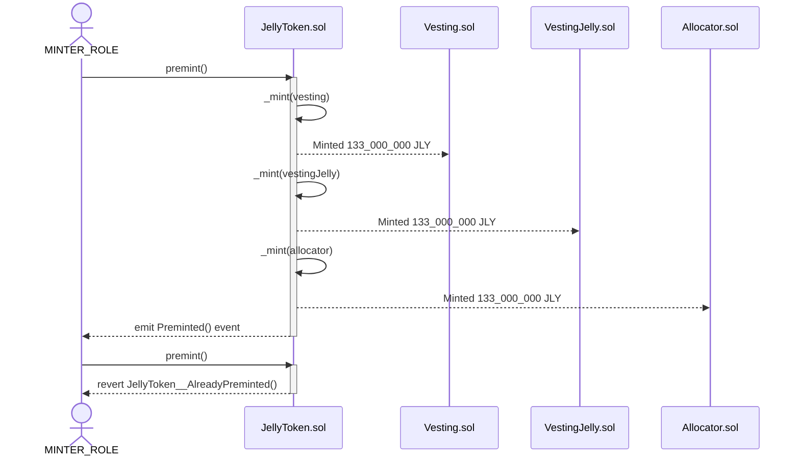
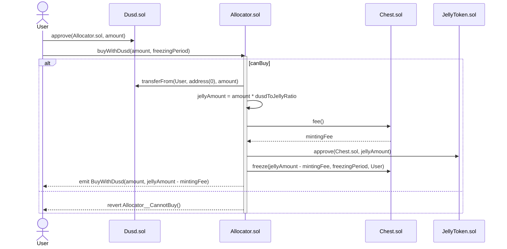
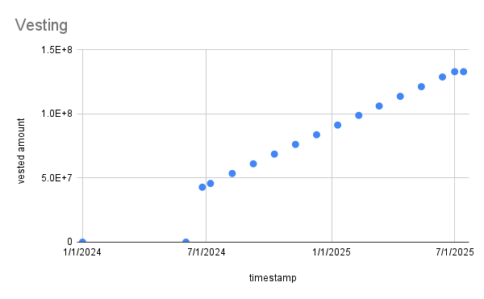

# Jelly Verse contracts

## Getting Started

This project combines Hardhat and Foundry.

### Prerequisites

Be sure to have installed the following

- [Git](https://git-scm.com/book/en/v2/Getting-Started-Installing-Git)
- [Current LTS Node.js version](https://nodejs.org/en/about/releases/)

### Build & Compile

1. Clone the repo

```shell
git clone git@github.com:MVPWorkshop/jelly-verse-contracts.git && cd jelly-verse-contracts
```

2. Install packages

```shell
npm install
```

3. Install [Foundry](https://book.getfoundry.sh/getting-started/installation)

```shell
curl -L https://foundry.paradigm.xyz | bash
foundryup
```

4. Compile contracts

```shell
npx hardhat compile
```

[Optionally]

```shell
forge build
```

5. Run tests

```shell
npx hardhat test
```

6. Run invariant tests

```shell
forge test
```

## Usage

This project consists of the following smart contracts:

- [JellyToken](./contracts/JellyToken.sol)
- [Vesting](./contracts/Vesting.sol)
- [VestingJelly](./contracts/VestingJelly.sol)
- [Allocator](./contracts/Allocator.sol)
- [Chest](./contracts/Chest.sol)

This is the UML dependency graph between these contracts:


### Sequence Diagrams

This is the overview of the functionalities of this project:

#### Pre-minting of tokens



#### Community members can buy JLY tokens with DUSD and DFI

Buying JLY tokens with DFI locks tokens into the Chest NFT smart contract with a linear vesting schedule. Chest NFTs are non-transferable and give voting power to the holder.

Buying JLY tokens with DUSD adds tokens to the JellyVerse DEX pool and gives JLY tokens back to the User instantly. There is no vesting schedule, but also no voting power through the Chest NFT.



#### Tokens for Team Members and Investors

Tokens for Team members and Investors are linearly vested through Vesting and VestingJelly smart contract.

```
/**
 *  token amount
 *       ^
 *       |                           __________________
 *       |                          /
 *       |                         /
 *       |                        /
 *       |                       /
 *       |                      /
 *       | <----- cliff ----->
 *       |
 *       |
 *        --------------------.------.-------------------> time
 *                         vesting duration
 */
```

There is a set of Differential tests to confirm that the calculation for the vesting schedule is correct.



Team members and Investors can convert the portion or the whole amount of their vested tokens into Chest NFTs to gain voting power.

The voting power is calculated using the following formula:

$$ boosterCoefficient(t) = { maxBooster \over 1 + e^{(-k (t - tmid))}} $$
​

### JellyToken

**Inherits:**
[ERC20Capped](/contracts/vendor/openzeppelin/v4.9.0/token/ERC20/extensions/ERC20Capped.sol/abstract.ERC20Capped.md), [AccessControl](/contracts/vendor/openzeppelin/v4.9.0/access/AccessControl.sol/abstract.AccessControl.md), [ReentrancyGuard](/contracts/vendor/openzeppelin/v4.9.0/security/ReentrancyGuard.sol/abstract.ReentrancyGuard.md)

#### State Variables

##### MINTER_ROLE

```solidity
bytes32 public constant MINTER_ROLE = keccak256("MINTER_ROLE");
```

##### preminted

```solidity
bool internal preminted;
```

| Name          | Type                                              | Slot | Offset | Bytes | Contract                            |
| ------------- | ------------------------------------------------- | ---- | ------ | ----- | ----------------------------------- |
| \_balances    | mapping(address => uint256)                       | 0    | 0      | 32    | contracts/JellyToken.sol:JellyToken |
| \_allowances  | mapping(address => mapping(address => uint256))   | 1    | 0      | 32    | contracts/JellyToken.sol:JellyToken |
| \_totalSupply | uint256                                           | 2    | 0      | 32    | contracts/JellyToken.sol:JellyToken |
| \_name        | string                                            | 3    | 0      | 32    | contracts/JellyToken.sol:JellyToken |
| \_symbol      | string                                            | 4    | 0      | 32    | contracts/JellyToken.sol:JellyToken |
| \_roles       | mapping(bytes32 => struct AccessControl.RoleData) | 5    | 0      | 32    | contracts/JellyToken.sol:JellyToken |
| \_status      | uint256                                           | 6    | 0      | 32    | contracts/JellyToken.sol:JellyToken |
| preminted     | bool                                              | 7    | 0      | 1     | contracts/JellyToken.sol:JellyToken |

#### Functions

##### onlyOnce

```solidity
modifier onlyOnce();
```

##### constructor

```solidity
constructor(address _defaultAdminRole) ERC20("Jelly Token", "JLY") ERC20Capped(1_000_000_000 * 10 ** decimals());
```

##### premint

```solidity
function premint(address _vesting, address _vestingJelly, address _allocator, address _minterContract)
    external
    onlyRole(MINTER_ROLE)
    onlyOnce
    nonReentrant;
```

##### mint

Mints specified amount of tokens to address.

_Only addresses with MINTER_ROLE can call._

```solidity
function mint(address to, uint256 amount) external onlyRole(MINTER_ROLE);
```

**Parameters**

| Name     | Type      | Description                                              |
| -------- | --------- | -------------------------------------------------------- |
| `to`     | `address` | - address to mint tokens for.                            |
| `amount` | `uint256` | - amount of tokens to mint. No return, reverts on error. |

#### Events

##### Preminted

```solidity
event Preminted(address indexed vesting, address indexed vestingJelly, address indexed allocator);
```

#### Errors

##### JellyToken\_\_AlreadyPreminted

```solidity
error JellyToken__AlreadyPreminted();
```

### VestingLib

**Inherits:**
[Ownable](/contracts/utils/Ownable.sol/abstract.Ownable.md)

#### State Variables

##### vestingConfig

```solidity
VestingConfig internal vestingConfig;
```

##### vestingPositions

```solidity
mapping(address => VestingPosition) internal vestingPositions;
```

| Name             | Type                                                  | Slot | Offset | Bytes | Contract                                  |
| ---------------- | ----------------------------------------------------- | ---- | ------ | ----- | ----------------------------------------- |
| \_owner          | address                                               | 0    | 0      | 20    | contracts/utils/VestingLib.sol:VestingLib |
| \_pendingOwner   | address                                               | 1    | 0      | 20    | contracts/utils/VestingLib.sol:VestingLib |
| vestingConfig    | struct VestingLib.VestingConfig                       | 2    | 0      | 32    | contracts/utils/VestingLib.sol:VestingLib |
| vestingPositions | mapping(address => struct VestingLib.VestingPosition) | 3    | 0      | 32    | contracts/utils/VestingLib.sol:VestingLib |

#### Functions

##### constructor

```solidity
constructor(
    uint48 _startTimestamp,
    uint32 _cliffDuration,
    uint32 _vestingDuration,
    address _owner,
    address _pendingOwner
) Ownable(_owner, _pendingOwner);
```

##### startVesting

```solidity
function startVesting() external onlyOwner;
```

##### configureVestingSchedule

```solidity
function configureVestingSchedule(uint48 startTimestamp, uint32 cliffDuration, uint32 vestingDuration)
    external
    onlyOwner;
```

##### releasableAmount

Calculates the amount that has already vested but hasn't been released yet

```solidity
function releasableAmount(address account) public view returns (uint256);
```

**Returns**

| Name     | Type      | Description                                                     |
| -------- | --------- | --------------------------------------------------------------- |
| `<none>` | `uint256` | uint256 The amount that has vested but hasn't been released yet |

##### vestedAmount

```solidity
function vestedAmount(address account) internal view returns (uint256 vestedAmount_);
```

##### \_configureVestingSchedule

```solidity
function _configureVestingSchedule(uint48 startTimestamp, uint32 cliffDuration, uint32 vestingDuration) private;
```

#### Events

##### VestingScheduleConfigured

```solidity
event VestingScheduleConfigured(uint48 startTimestamp, uint48 cliffTimestamp, uint32 totalDuration);
```

##### VestingStarted

```solidity
event VestingStarted();
```

#### Errors

##### VestingLib\_\_VestingAlreadyStarted

```solidity
error VestingLib__VestingAlreadyStarted();
```

##### VestingLib\_\_StartTimestampMustNotBeInThePast

```solidity
error VestingLib__StartTimestampMustNotBeInThePast();
```

##### VestingLib\_\_InvalidDuration

```solidity
error VestingLib__InvalidDuration();
```

#### Structs

##### VestingPosition

```solidity
struct VestingPosition {
    uint256 totalVestedAmount;
    uint256 releasedAmount;
}
```

##### VestingConfig

```solidity
struct VestingConfig {
    uint48 startTimestamp;
    uint48 cliffTimestamp;
    uint32 totalDuration;
    bool isVestingStarted;
}
```

### VestingTeam

**Inherits:**
[VestingLib](/contracts/utils/VestingLib.sol/abstract.VestingLib.md), [ReentrancyGuard](/contracts/vendor/openzeppelin/v4.9.0/security/ReentrancyGuard.sol/abstract.ReentrancyGuard.md)

#### State Variables

##### i_beneficiary

```solidity
address immutable i_beneficiary;
```

##### i_revoker

```solidity
address immutable i_revoker;
```

##### i_token

```solidity
address immutable i_token;
```

| Name             | Type                                                  | Slot | Offset | Bytes | Contract                              |
| ---------------- | ----------------------------------------------------- | ---- | ------ | ----- | ------------------------------------- |
| \_owner          | address                                               | 0    | 0      | 20    | contracts/VestingTeam.sol:VestingTeam |
| \_pendingOwner   | address                                               | 1    | 0      | 20    | contracts/VestingTeam.sol:VestingTeam |
| vestingConfig    | struct VestingLib.VestingConfig                       | 2    | 0      | 32    | contracts/VestingTeam.sol:VestingTeam |
| vestingPositions | mapping(address => struct VestingLib.VestingPosition) | 3    | 0      | 32    | contracts/VestingTeam.sol:VestingTeam |
| \_status         | uint256                                               | 4    | 0      | 32    | contracts/VestingTeam.sol:VestingTeam |

#### Functions

##### onlyRevoker

```solidity
modifier onlyRevoker();
```

##### constructor

```solidity
constructor(
    uint256 _amount,
    address _beneficiary,
    address _revoker,
    address _token,
    uint48 _startTimestamp,
    uint32 _cliffDuration,
    uint32 _vestingDuration,
    address _owner,
    address _pendingOwner
) VestingLib(_startTimestamp, _cliffDuration, _vestingDuration, _owner, _pendingOwner);
```

##### release

Release vested tokens
No return, reverts on error

```solidity
function release() external onlyRevoker nonReentrant;
```

#### Events

##### Release

```solidity
event Release(address indexed beneficiary, uint256 amount);
```

#### Errors

##### VestingTeam\_\_OnlyRevokerCanCall

```solidity
error VestingTeam__OnlyRevokerCanCall(address caller);
```

##### VestingTeam\_\_ZeroAddress

```solidity
error VestingTeam__ZeroAddress(string variableName);
```

##### VestingTeam\_\_NothingToRelease

```solidity
error VestingTeam__NothingToRelease();
```

### VestingInvestor

**Inherits:**
[VestingLib](/contracts/utils/VestingLib.sol/abstract.VestingLib.md), [ReentrancyGuard](/contracts/vendor/openzeppelin/v4.9.0/security/ReentrancyGuard.sol/abstract.ReentrancyGuard.md)

Contract for vesting jelly tokens for investors

#### State Variables

##### i_jellyToken

```solidity
address internal immutable i_jellyToken;
```

##### i_chest

```solidity
address internal immutable i_chest;
```

| Name             | Type                                                  | Slot | Offset | Bytes | Contract                                      |
| ---------------- | ----------------------------------------------------- | ---- | ------ | ----- | --------------------------------------------- |
| \_owner          | address                                               | 0    | 0      | 20    | contracts/VestingInvestor.sol:VestingInvestor |
| \_pendingOwner   | address                                               | 1    | 0      | 20    | contracts/VestingInvestor.sol:VestingInvestor |
| vestingConfig    | struct VestingLib.VestingConfig                       | 2    | 0      | 32    | contracts/VestingInvestor.sol:VestingInvestor |
| vestingPositions | mapping(address => struct VestingLib.VestingPosition) | 3    | 0      | 32    | contracts/VestingInvestor.sol:VestingInvestor |
| \_status         | uint256                                               | 4    | 0      | 32    | contracts/VestingInvestor.sol:VestingInvestor |

#### Functions

##### onlyOwnerOrBeneficiary

```solidity
modifier onlyOwnerOrBeneficiary(address beneficiary);
```

##### constructor

```solidity
constructor(
    address _jellyToken,
    address _chest,
    Beneficiary[] memory _beneficiaries,
    uint48 _startTimestamp,
    uint32 _cliffDuration,
    uint32 _vestingDuration,
    address _owner,
    address _pendingOwner
) VestingLib(_startTimestamp, _cliffDuration, _vestingDuration, _owner, _pendingOwner);
```

##### release

Releases vested tokens to the beneficiary.
No return, reverts on error.

```solidity
function release() external nonReentrant;
```

##### convertToChest

Converts vested tokens to chest NFT.

```solidity
function convertToChest(address beneficiary, uint256 amount, uint32 freezingPeriod)
    external
    onlyOwnerOrBeneficiary(beneficiary);
```

**Parameters**

| Name             | Type      | Description                                                           |
| ---------------- | --------- | --------------------------------------------------------------------- |
| `beneficiary`    | `address` | - address of beneficiary                                              |
| `amount`         | `uint256` | - amount of vested tokens to convert                                  |
| `freezingPeriod` | `uint32`  | - duration of freezing period in seconds No return, reverts on error. |

#### Events

##### Release

```solidity
event Release(address indexed beneficiary, uint256 amount);
```

##### ConvertToChest

```solidity
event ConvertToChest(address indexed beneficiary);
```

#### Errors

##### VestingInvestor\_\_ZeroAddress

```solidity
error VestingInvestor__ZeroAddress();
```

##### VestingInvestor\_\_NothingToRelease

```solidity
error VestingInvestor__NothingToRelease();
```

##### VestingInvestor\_\_InsufficientFunds

```solidity
error VestingInvestor__InsufficientFunds();
```

##### VestingInvestor\_\_OnlyOwnerOrBeneficiaryCanCall

```solidity
error VestingInvestor__OnlyOwnerOrBeneficiaryCanCall(address caller);
```

#### Structs

##### Beneficiary

```solidity
struct Beneficiary {
    address _address;
    uint32 _amount;
}
```

### Allocator

**Inherits:**
[ReentrancyGuard](/contracts/vendor/openzeppelin/v4.9.0/security/ReentrancyGuard.sol/abstract.ReentrancyGuard.md), [Ownable](/contracts/utils/Ownable.sol/abstract.Ownable.md)

Contract for swapping dusd tokens for jelly tokens

#### State Variables

##### i_jellyToken

```solidity
address internal immutable i_jellyToken;
```

##### i_chest

```solidity
address internal immutable i_chest;
```

##### i_dusd

```solidity
address internal immutable i_dusd;
```

##### i_wdfi

```solidity
address internal immutable i_wdfi;
```

##### dusdToJellyRatio

```solidity
uint256 internal dusdToJellyRatio;
```

##### wdfiToJellyRatio

```solidity
uint256 internal wdfiToJellyRatio;
```

##### jellySwapPoolId

```solidity
bytes32 internal jellySwapPoolId;
```

##### jellySwapVault

```solidity
address internal jellySwapVault;
```

##### isOver

```solidity
bool internal isOver;
```

| Name             | Type    | Slot | Offset | Bytes | Contract                          |
| ---------------- | ------- | ---- | ------ | ----- | --------------------------------- |
| \_status         | uint256 | 0    | 0      | 32    | contracts/Allocator.sol:Allocator |
| \_owner          | address | 1    | 0      | 20    | contracts/Allocator.sol:Allocator |
| \_pendingOwner   | address | 2    | 0      | 20    | contracts/Allocator.sol:Allocator |
| dusdToJellyRatio | uint256 | 3    | 0      | 32    | contracts/Allocator.sol:Allocator |
| wdfiToJellyRatio | uint256 | 4    | 0      | 32    | contracts/Allocator.sol:Allocator |
| jellySwapPoolId  | bytes32 | 5    | 0      | 32    | contracts/Allocator.sol:Allocator |
| jellySwapVault   | address | 6    | 0      | 20    | contracts/Allocator.sol:Allocator |
| isOver           | bool    | 6    | 20     | 1     | contracts/Allocator.sol:Allocator |

#### Functions

##### canBuy

```solidity
modifier canBuy();
```

##### constructor

```solidity
constructor(
    address _jellyToken,
    address _chest,
    address _dusd,
    address _wdfi,
    uint256 _dusdToJellyRatio,
    uint256 _wdfiToJellyRatio,
    address _jellySwapVault,
    bytes32 _jellySwapPoolId,
    address _owner,
    address _pendingOwner
) Ownable(_owner, _pendingOwner);
```

##### buyWithDusd

Buys jelly tokens with dusd.

```solidity
function buyWithDusd(uint256 amount, uint32 freezingPeriod) external nonReentrant canBuy;
```

**Parameters**

| Name             | Type      | Description                                                            |
| ---------------- | --------- | ---------------------------------------------------------------------- |
| `amount`         | `uint256` | - amount of dusd tokens deposited.                                     |
| `freezingPeriod` | `uint32`  | - duration of freezing period in seconds. No return, reverts on error. |

##### buyWithDfi

Buys jelly tokens with wdfi.

```solidity
function buyWithDfi(uint256 amount) external nonReentrant canBuy;
```

**Parameters**

| Name     | Type      | Description                                                     |
| -------- | --------- | --------------------------------------------------------------- |
| `amount` | `uint256` | - amount of wdfi tokens deposited. No return, reverts on error. |

##### endBuyingPeriod

Ends buying period.

_Only owner can call.
No return, reverts on error._

```solidity
function endBuyingPeriod() external onlyOwner;
```

##### setDusdToJellyRatio

Sets dusd to jelly ratio.

_Only owner can call._

```solidity
function setDusdToJellyRatio(uint256 _dusdToJellyRatio) external onlyOwner;
```

**Parameters**

| Name                | Type      | Description                                                   |
| ------------------- | --------- | ------------------------------------------------------------- |
| `_dusdToJellyRatio` | `uint256` | - ratio of dusd to jelly tokens. No return, reverts on error. |

##### setWdfiToJellyRatio

Sets wdfi to jelly ratio.

_Only owner can call._

```solidity
function setWdfiToJellyRatio(uint256 _wdfiToJellyRatio) external onlyOwner;
```

**Parameters**

| Name                | Type      | Description                                                   |
| ------------------- | --------- | ------------------------------------------------------------- |
| `_wdfiToJellyRatio` | `uint256` | - ratio of wdfi to jelly tokens. No return, reverts on error. |

##### getRatios

Gets To Jelly Ratios.

```solidity
function getRatios() external view returns (uint256, uint256);
```

**Returns**

| Name     | Type      | Description                                       |
| -------- | --------- | ------------------------------------------------- |
| `<none>` | `uint256` | dusdToJellyRatio - ratio of dusd to jelly tokens. |
| `<none>` | `uint256` | wdfiToJellyRatio - ratio of wdfi to jelly tokens. |

##### \_convertERC20sToAssets

```solidity
function _convertERC20sToAssets(IERC20[] memory tokens) internal pure returns (IAsset[] memory assets);
```

#### Events

##### BuyWithDusd

```solidity
event BuyWithDusd(uint256 dusdAmount, uint256 jellyAmount);
```

##### BuyWithDfi

```solidity
event BuyWithDfi(uint256 wdfiAmount, uint256 jellyAmount);
```

##### EndBuyingPeriod

```solidity
event EndBuyingPeriod();
```

##### DusdToJellyRatioSet

```solidity
event DusdToJellyRatioSet(uint256 dusdToJellyRatio);
```

##### WdfiToJellyRatioSet

```solidity
event WdfiToJellyRatioSet(uint256 wdfiToJellyRatio);
```

#### Errors

##### Allocator\_\_CannotBuy

```solidity
error Allocator__CannotBuy();
```

##### Allocator\_\_NothingToRelease

```solidity
error Allocator__NothingToRelease();
```

##### Allocator\_\_InsufficientFunds

```solidity
error Allocator__InsufficientFunds();
```

### Chest

**Inherits:**
ERC721URIStorage, [Ownable](/contracts/utils/Ownable.sol/abstract.Ownable.md), [ReentrancyGuard](/contracts/vendor/openzeppelin/v4.9.0/security/ReentrancyGuard.sol/abstract.ReentrancyGuard.md)

#### State Variables

##### BASE_SVG

```solidity
string constant BASE_SVG =
    "<svg id='jellys' xmlns='http://www.w3.org/2000/svg' xmlns:xlink='http://www.w3.org/1999/xlink' viewBox='0 0 300 100' shape-rendering='geometricPrecision' text-rendering='geometricPrecision'><defs><linearGradient id='ekns5QaWV3l2-fill' x1='0' y1='0.5' x2='1' y2='0.5' spreadMethod='pad' gradientUnits='objectBoundingBox' gradientTransform='translate(0 0)'><stop id='ekns5QaWV3l2-fill-0' offset='0%' stop-color='#9292ff'/><stop id='ekns5QaWV3l2-fill-1' offset='100%' stop-color='#fb42ff'/></linearGradient></defs><rect width='300' height='111.780203' rx='0' ry='0' transform='matrix(1 0 0 0.900963 0 0)' fill='url(#ekns5QaWV3l2-fill)'/><text dx='0' dy='0' font-family='&quot;jellys:::Montserrat&quot;' font-size='16' font-weight='400' transform='translate(15.979677 32.100672)' fill='#fff' stroke-width='0' xml:space='preserve'><tspan y='0' font-weight='400' stroke-width='0'><![CDATA[{]]></tspan><tspan x='0' y='16' font-weight='400' stroke-width='0'><![CDATA[    until:";
```

##### MIDDLE_PART_SVG

```solidity
string constant MIDDLE_PART_SVG =
    "]]></tspan><tspan x='0' y='32' font-weight='400' stroke-width='0'><![CDATA[    amount:";
```

##### END_SVG

```solidity
string constant END_SVG =
    "]]></tspan><tspan x='0' y='48' font-weight='400' stroke-width='0'><![CDATA[}]]></tspan></text></svg>";
```

##### i_jellyToken

```solidity
address internal immutable i_jellyToken;
```

##### tokenId

```solidity
uint256 internal tokenId;
```

##### fee

```solidity
uint256 public fee;
```

##### boosterThreshold

```solidity
uint256 internal boosterThreshold;
```

##### minimalStakingPower

```solidity
uint256 internal minimalStakingPower;
```

##### maxBooster

```solidity
uint256 internal maxBooster;
```

##### timeFactor

```solidity
uint256 internal timeFactor;
```

##### startTimestamp

```solidity
uint48 internal startTimestamp;
```

##### cliffTimestamp

```solidity
uint48 internal cliffTimestamp;
```

##### isVestingStarted

```solidity
bool public isVestingStarted;
```

##### positions

```solidity
mapping(uint256 => Metadata) internal positions;
```

| Name                | Type                                         | Slot | Offset | Bytes | Contract                  |
| ------------------- | -------------------------------------------- | ---- | ------ | ----- | ------------------------- |
| \_name              | string                                       | 0    | 0      | 32    | contracts/Chest.sol:Chest |
| \_symbol            | string                                       | 1    | 0      | 32    | contracts/Chest.sol:Chest |
| \_owners            | mapping(uint256 => address)                  | 2    | 0      | 32    | contracts/Chest.sol:Chest |
| \_balances          | mapping(address => uint256)                  | 3    | 0      | 32    | contracts/Chest.sol:Chest |
| \_tokenApprovals    | mapping(uint256 => address)                  | 4    | 0      | 32    | contracts/Chest.sol:Chest |
| \_operatorApprovals | mapping(address => mapping(address => bool)) | 5    | 0      | 32    | contracts/Chest.sol:Chest |
| \_tokenURIs         | mapping(uint256 => string)                   | 6    | 0      | 32    | contracts/Chest.sol:Chest |
| \_owner             | address                                      | 7    | 0      | 20    | contracts/Chest.sol:Chest |
| \_pendingOwner      | address                                      | 8    | 0      | 20    | contracts/Chest.sol:Chest |
| \_status            | uint256                                      | 9    | 0      | 32    | contracts/Chest.sol:Chest |
| tokenId             | uint256                                      | 10   | 0      | 32    | contracts/Chest.sol:Chest |
| fee                 | uint256                                      | 11   | 0      | 32    | contracts/Chest.sol:Chest |
| boosterThreshold    | uint256                                      | 12   | 0      | 32    | contracts/Chest.sol:Chest |
| minimalStakingPower | uint256                                      | 13   | 0      | 32    | contracts/Chest.sol:Chest |
| maxBooster          | uint256                                      | 14   | 0      | 32    | contracts/Chest.sol:Chest |
| timeFactor          | uint256                                      | 15   | 0      | 32    | contracts/Chest.sol:Chest |
| startTimestamp      | uint48                                       | 16   | 0      | 6     | contracts/Chest.sol:Chest |
| cliffTimestamp      | uint48                                       | 16   | 6      | 6     | contracts/Chest.sol:Chest |
| isVestingStarted    | bool                                         | 16   | 12     | 1     | contracts/Chest.sol:Chest |
| positions           | mapping(uint256 => struct Chest.Metadata)    | 17   | 0      | 32    | contracts/Chest.sol:Chest |

#### Functions

##### onlyAuthorizedForToken

```solidity
modifier onlyAuthorizedForToken(uint256 _tokenId);
```

##### constructor

```solidity
constructor(
    address _jellyToken,
    uint256 _fee,
    uint256 _boosterThreshold,
    uint256 _minimalStakingPower,
    uint256 _maxBooster,
    uint256 _timeFactor,
    uint48 _startTimestamp,
    uint32 _cliffDuration,
    address _owner,
    address _pendingOwner
) ERC721("Chest", "CHEST") Ownable(_owner, _pendingOwner);
```

##### freeze

Freezes tokens for vesting.

```solidity
function freeze(uint256 _amount, uint32 _freezingPeriod, address _to) external nonReentrant;
```

**Parameters**

| Name              | Type      | Description                                                |
| ----------------- | --------- | ---------------------------------------------------------- |
| `_amount`         | `uint256` | - amount of tokens to freeze.                              |
| `_freezingPeriod` | `uint32`  | - duration of freezing period in seconds.                  |
| `_to`             | `address` | - address of the beneficiary. No return, reverts on error. |

##### increaseStake

Increases stake.

```solidity
function increaseStake(uint256 _tokenId, uint256 _amount, uint32 _freezingPeriod)
    external
    onlyAuthorizedForToken(_tokenId)
    nonReentrant;
```

**Parameters**

| Name              | Type      | Description                                                            |
| ----------------- | --------- | ---------------------------------------------------------------------- |
| `_tokenId`        | `uint256` | - id of the chest.                                                     |
| `_amount`         | `uint256` | - amount of tokens to stake.                                           |
| `_freezingPeriod` | `uint32`  | - duration of freezing period in seconds. No return, reverts on error. |

##### unstake

Unstakes tokens.

```solidity
function unstake(uint256 _tokenId, uint256 _amount) external onlyAuthorizedForToken(_tokenId) nonReentrant;
```

**Parameters**

| Name       | Type      | Description                                                 |
| ---------- | --------- | ----------------------------------------------------------- |
| `_tokenId` | `uint256` | - id of the chest.                                          |
| `_amount`  | `uint256` | - amount of tokens to unstake. No return, reverts on error. |

##### releasableAmount

Calculates amount of tokens that can be released at the moment.

```solidity
function releasableAmount(uint256 _tokenId) public view returns (uint256);
```

**Parameters**

| Name       | Type      | Description        |
| ---------- | --------- | ------------------ |
| `_tokenId` | `uint256` | - id of the chest. |

**Returns**

| Name     | Type      | Description                                                    |
| -------- | --------- | -------------------------------------------------------------- |
| `<none>` | `uint256` | uint256 - Amount of tokens that can be released at the moment. |

##### setFee

Sets fee in Jelly token for minting a chest.

_Only owner can call._

```solidity
function setFee(uint256 _fee) external onlyOwner;
```

**Parameters**

| Name   | Type      | Description                             |
| ------ | --------- | --------------------------------------- |
| `_fee` | `uint256` | - new fee. No return, reverts on error. |

##### setBoosterThreshold

Sets booster threshold.

_Only owner can call._

```solidity
function setBoosterThreshold(uint256 _boosterThreshold) external onlyOwner;
```

**Parameters**

| Name                | Type      | Description                                           |
| ------------------- | --------- | ----------------------------------------------------- |
| `_boosterThreshold` | `uint256` | - new booster threshold. No return, reverts on error. |

##### setMinimalStakingPower

Sets minimal staking power.

_Only owner can call._

```solidity
function setMinimalStakingPower(uint256 _minimalStakingPower) external onlyOwner;
```

**Parameters**

| Name                   | Type      | Description                                               |
| ---------------------- | --------- | --------------------------------------------------------- |
| `_minimalStakingPower` | `uint256` | - new minimal staking power. No return, reverts on error. |

##### setMaxBooster

Sets maximal booster.

_Only owner can call._

```solidity
function setMaxBooster(uint256 _maxBooster) external onlyOwner;
```

**Parameters**

| Name          | Type      | Description                                         |
| ------------- | --------- | --------------------------------------------------- |
| `_maxBooster` | `uint256` | - new maximal booster. No return, reverts on error. |

##### calculateBooster

Calculates the booster of the chest.

```solidity
function calculateBooster(uint256 _tokenId) public view returns (uint256 booster);
```

**Parameters**

| Name       | Type      | Description        |
| ---------- | --------- | ------------------ |
| `_tokenId` | `uint256` | - id of the chest. |

**Returns**

| Name      | Type      | Description             |
| --------- | --------- | ----------------------- |
| `booster` | `uint256` | - booster of the chest. |

##### getChestPower

Calculates the voting power of the chest.

```solidity
function getChestPower(uint256 _tokenId) external view returns (uint256 power);
```

**Parameters**

| Name       | Type      | Description        |
| ---------- | --------- | ------------------ |
| `_tokenId` | `uint256` | - id of the chest. |

**Returns**

| Name    | Type      | Description                  |
| ------- | --------- | ---------------------------- |
| `power` | `uint256` | - voting power of the chest. |

##### formatTokenUri

```solidity
function formatTokenUri(uint256 _amount, uint256 _freezedUntil) internal pure returns (string memory);
```

##### vestedAmount

```solidity
function vestedAmount(uint256 _tokenId) internal view returns (uint256 vestedAmount_);
```

##### \_beforeTokenTransfer

```solidity
function _beforeTokenTransfer(address from, address to, uint256, uint256) internal pure override;
```

#### Events

##### Freeze

```solidity
event Freeze(address indexed user, uint256 indexed tokenId, uint256 amount, uint256 freezedUntil);
```

##### IncreaseStake

```solidity
event IncreaseStake(uint256 indexed tokenId, uint256 totalStaked, uint256 freezedUntil);
```

##### Unstake

```solidity
event Unstake(uint256 indexed tokenId, uint256 amount, uint256 totalStaked);
```

##### SetFee

```solidity
event SetFee(uint256 fee);
```

##### SetBoosterThreshold

```solidity
event SetBoosterThreshold(uint256 boosterThreshold);
```

##### SetMinimalStakingPower

```solidity
event SetMinimalStakingPower(uint256 minimalStakingPower);
```

##### SetMaxBooster

```solidity
event SetMaxBooster(uint256 maxBooster);
```

#### Errors

##### Chest\_\_ZeroAddress

```solidity
error Chest__ZeroAddress();
```

##### Chest\_\_NonTransferrableToken

```solidity
error Chest__NonTransferrableToken();
```

##### Chest\_\_NotAuthorizedForToken

```solidity
error Chest__NotAuthorizedForToken();
```

##### Chest\_\_FreezingPeriodNotOver

```solidity
error Chest__FreezingPeriodNotOver();
```

##### Chest\_\_CannotUnstakeMoreThanReleasable

```solidity
error Chest__CannotUnstakeMoreThanReleasable();
```

##### Chest\_\_NothingToUnstake

```solidity
error Chest__NothingToUnstake();
```

#### Structs

##### Metadata

```solidity
struct Metadata {
    uint256 totalStaked;
    uint256 unfrozen;
    uint48 freezedUntil;
    uint48 latestUnstake;
}
```
