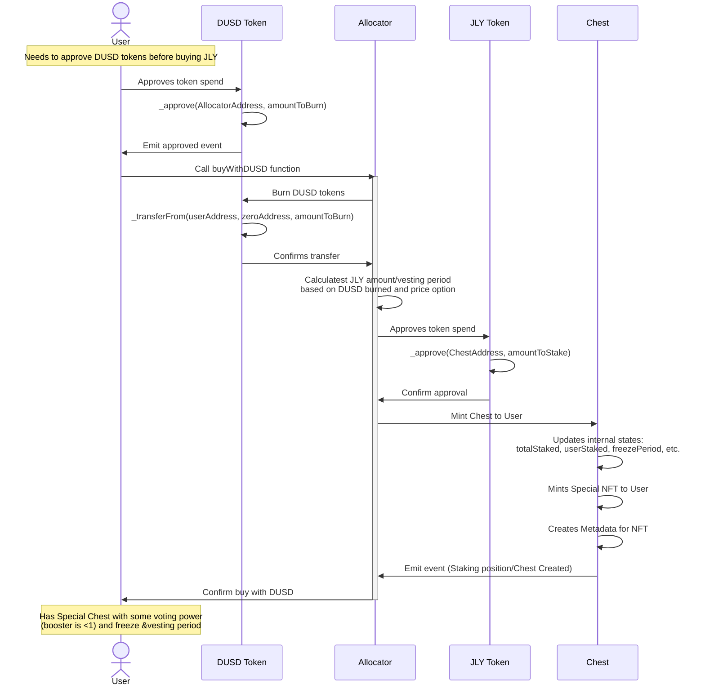
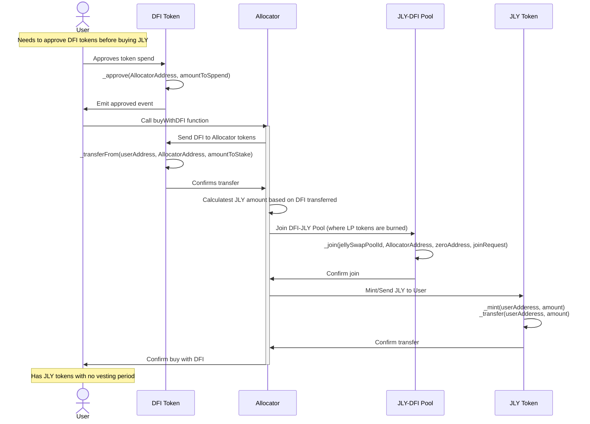

## Burn DUSD and Liquidity providing with DFI

 Community members can get JLY with DUSD and DFI. DUSD should be burned, and DFI should be deposited to the DFI-JLY pool (along with some extra JLY, we need to figure out where we take that JLY from), and then those LP tokens should be burned. JLY that goes to the team and the investors should be vested completely for 6 months, and then linearly unvested for the next 18 months, and the same thing goes for the JLY users bought with DUSD. The JLY bought with DFI should not be vested. There is a chance that DUSD will not be available on DMC, and that burning will have to happen on the UTXO layer (native layer). In that case we need to think about how to best implement it.
 
#### dUSD burn
We want to expose multiple options to the users that will affect the price and the freezing period. For example:
option 1: jly price is 0.5 dUSD, with 4 years completely frozen plus 1 year linear unfreezing
option 2: jly price is 1 dUSD, with 6 years completely frozen plus 4 year linear unfreezing
We also want to limit the effects of the voting power for those NFTs, so that if the NFT is created trough the burn SC voting power has a multiplier that is < 1. The calculation then would be: voting_power = multiplier * booster * freezing_time_left * jly_amount.

## Characteristics

- JLY tokens can be bought with DUSD and DFI
    - DUSD should be burned
    - DFI should be deposited to the DFI-JLY pool (along with some extra JLY, we need to figure out where we take that JLY from)
- Special Chests Should be created for these events (freeze + vesting period)

## Sequence Diagrams

1. Buying JLY with DUSD flow

1. Buying JLY with DFI flow

