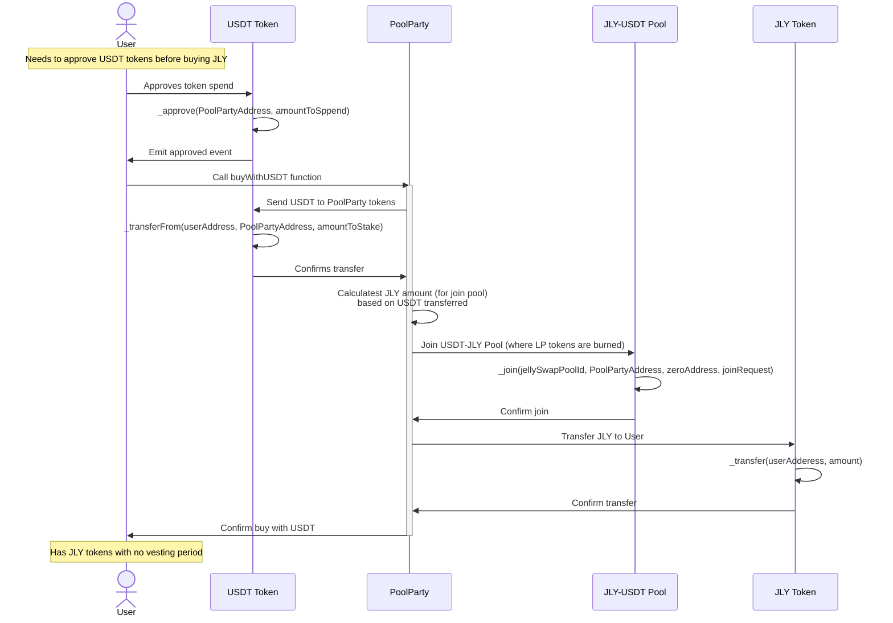

## Buy with USDT aka Pool Party
## Characteristics

- JLY tokens can be bought with USDT 
    - USDT should be deposited to the USDT-JLY pool (along with appropriate amount of JLY, based on rate)

## Sequence Diagrams

1. Buying JLY with USDT flow

