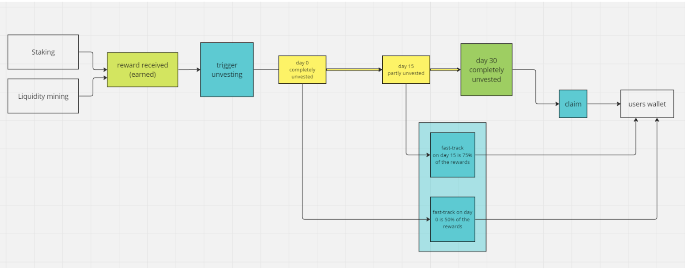
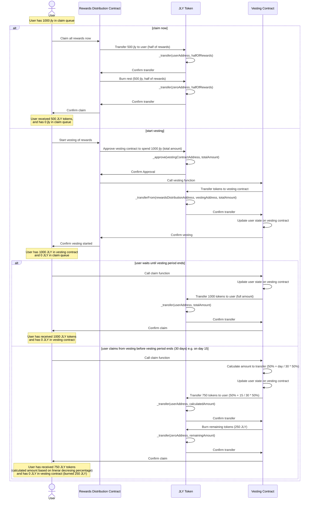

## Rewards Claiming (Vesting)

When users claim rewards we want to give them two options: claim now and lose a certain percentage of rewards (40% - 50%) or start a 30 day reward vesting period to get 100% of rewards. If the user triggers vesting, they can at any point sacrifice a percentage of their rewards to claim them right away, with the percentage loss linearly decreasing. The user cannot trigger another vesting (add new rewards to the currently vesting ones) before they claim the rewards that are currently vesting. For example a user has earned 1000 jly in rewards on day 0 and they want to claim them. If they click claim now they will receive 500 jly in their wallet right away. If they click start vesting the 1000 jly is added to their vesting bucket and they have to wait for 30 days before the jly will be available on their wallet (1000 jly in claim queue claimable on day 30). If after 15 days (on day 15) they want to claim the vesting rewards they can do so and claim 750 jly (50% + 15 / 30 * 50% = 75%). This probably means changing the reward distribution architecture so that if the user clicks claim in 30 days the rewards are sent to a new vesting SC, from which they are claimable from that point onwards.

Flow chart can be found in docs folder:

## Characteristics

- Rewards can be claimed immediately with 50% reduction in rewards or fully after a 30 day vesting period. If user wants to claim in between they can do so with a linearly decreasing percentage of rewards lost.
- Tax on rewards is burned.

## Sequence Diagrams

1. Claim immediately rewards flow (freeze period ended)

