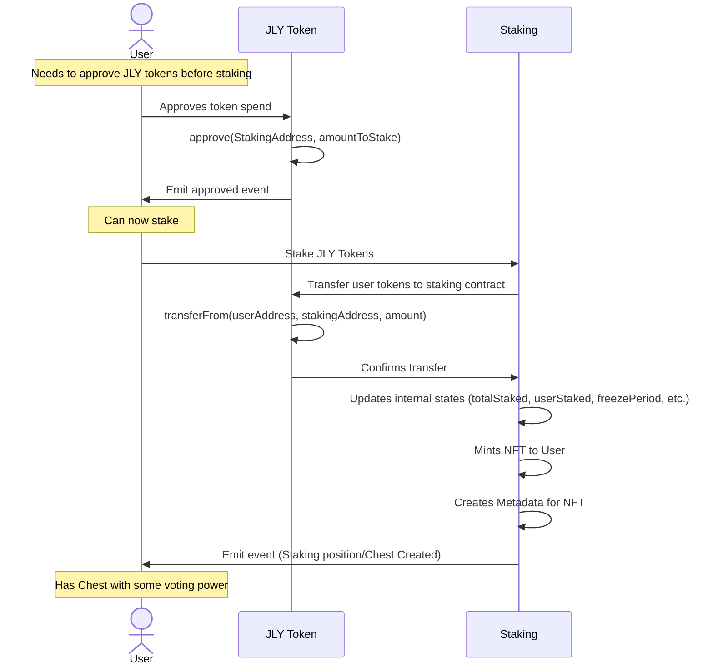
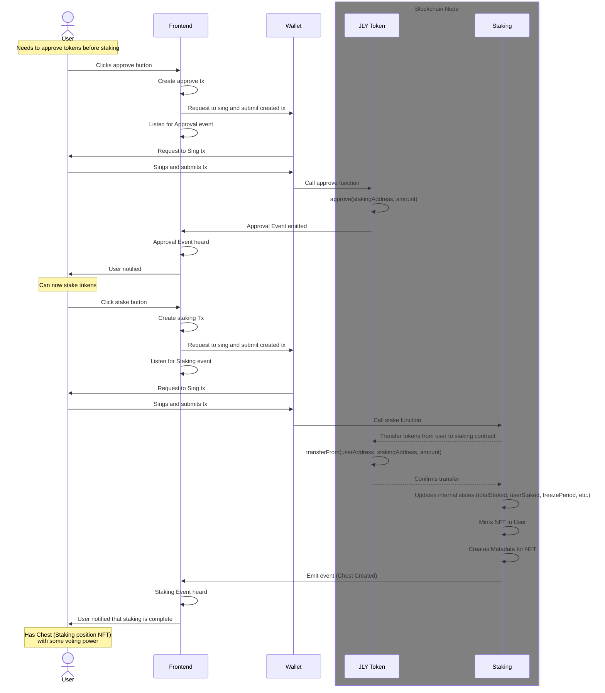
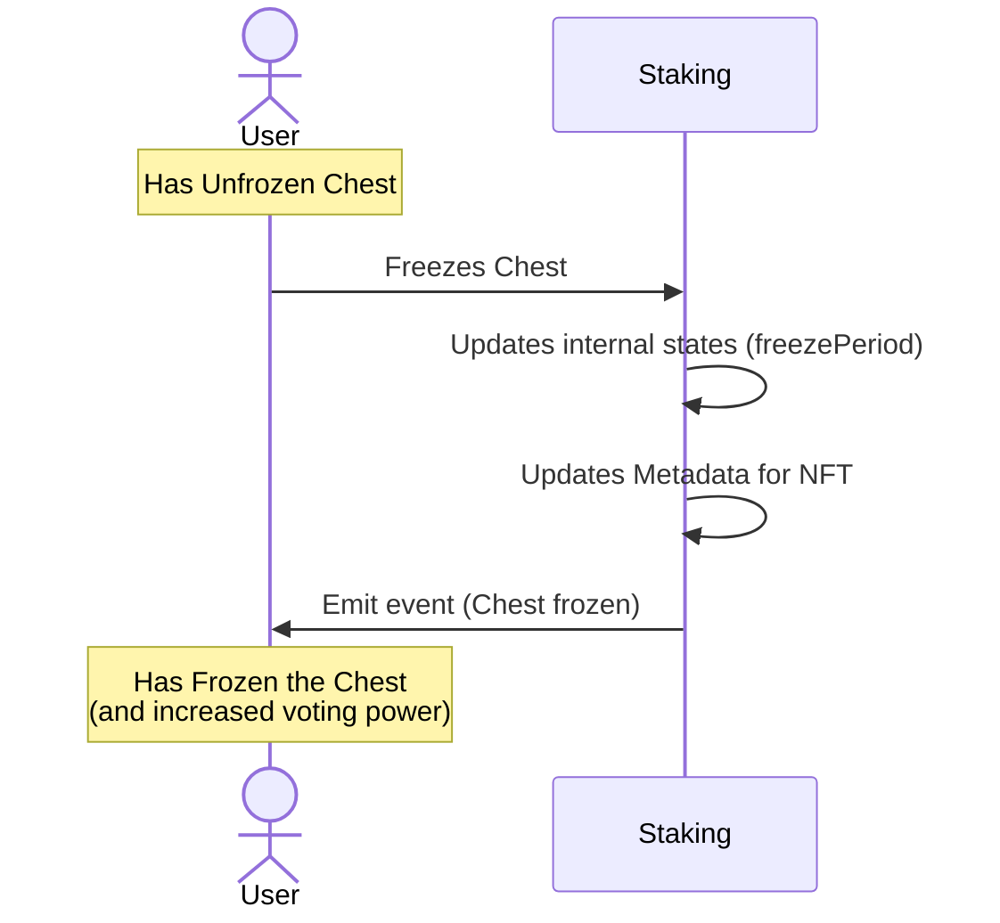
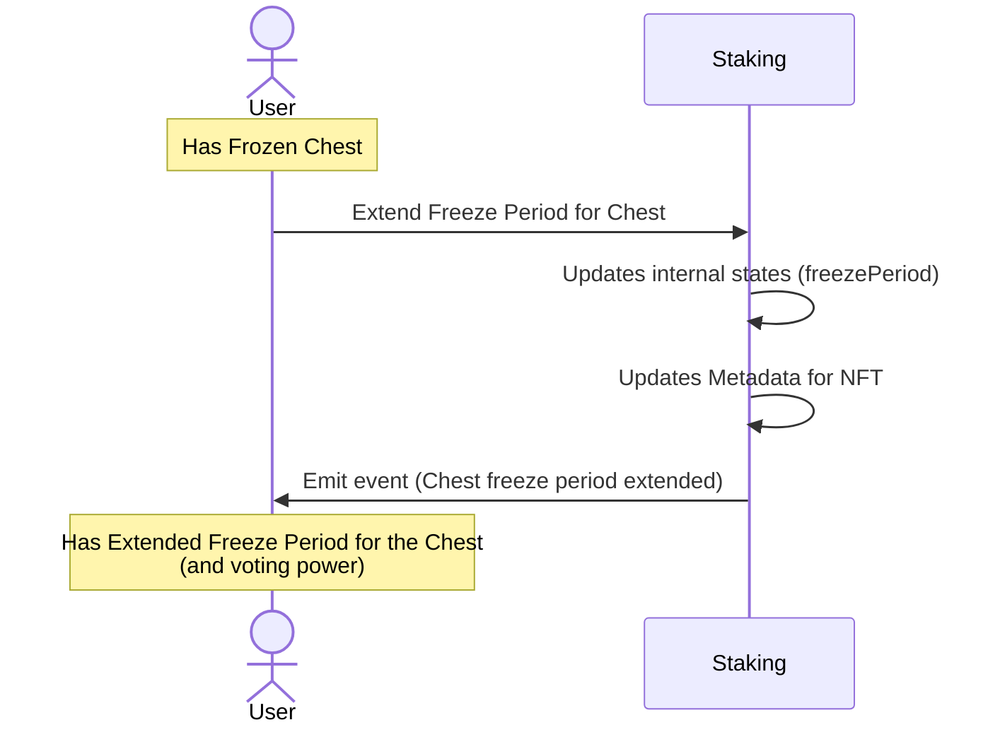
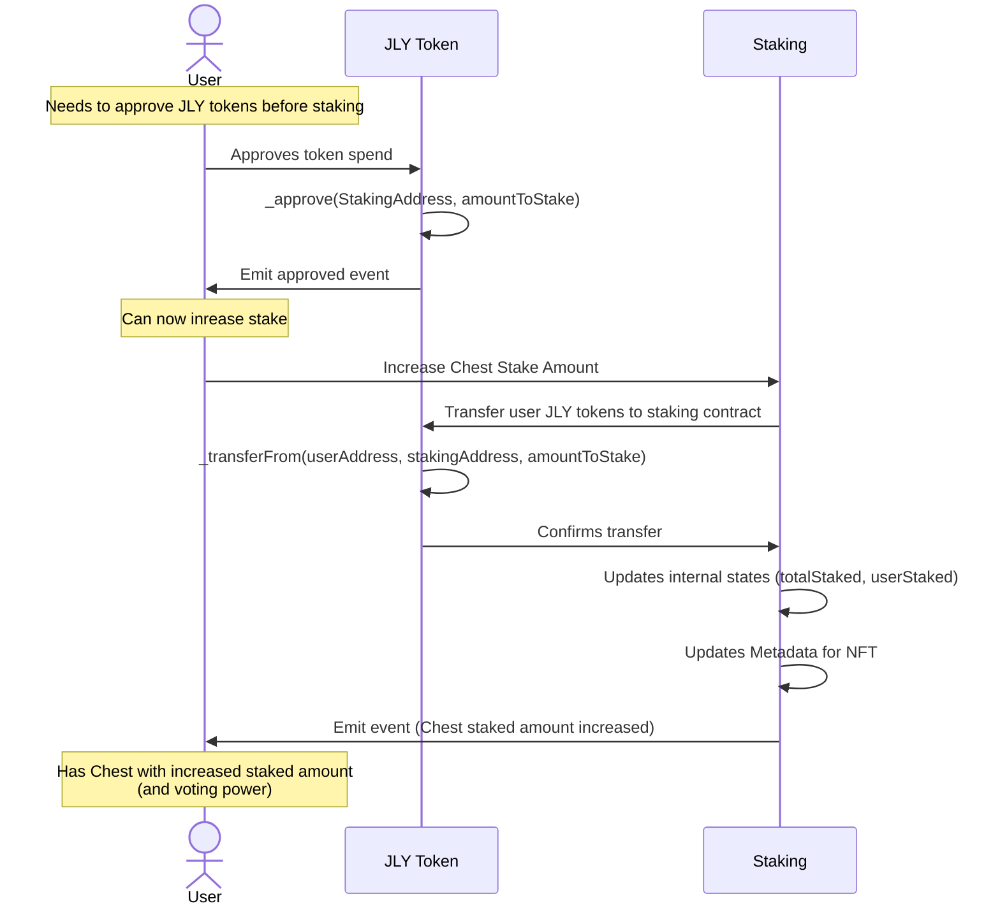
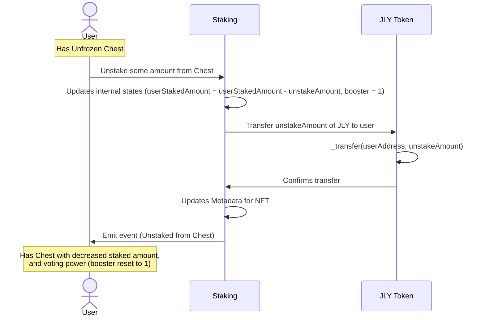

## Staking/Chest Contract

The staking functionality is supposed to allow users to freeze their JLY for a period of time, giving them voting power, a dedicated amount of block rewards, and a dedicated amount of rewards from all different protocols in jellyverse. The users should be able to open a new staking position, which is represented by an NFT. They can deposit JLY to that NFT and set a freezing period. They can, at any point in time, increase the amount of staked JLY, or the freezing period. Once the freezing period is over they can withdraw some or all of the deposited amount. The staking position NFT also has a booster coefficient that is a function of time the position is opened, with a minimum value of 1 at time = 0, and converging to a maximum amount. Withdrawing any amount of JLY resets the booster to the initial amount. Each NFT has a certain amount of “power”, calculated by the following formula: power = booster * depositedJelly * (Min(0, unfreezingTime - currentTime) + basePower). Each NFTs voting power and rewards are calculated as the pro rata share of all the available “power”.

Latest Figma Flows: https://www.figma.com/file/qGvBuurYYNwsOhAhUO9u8Q/Jellyverse?type=design&node-id=5785-16076&mode=design&t=rFTVHNOSgicTgiHC-4

## Characteristics

- Needs to be have staking, freezing, increasing stake amount/freezePeriod and unstaking
- Needs to be able to calculate voting power and rewards
- Needs to create NFT (Chest) which represents the staking position

## Sequence Diagrams

1. Staking JLY tokens flow (recieved Chest can be frozen or unfrozen)

Reference:
`The users should be able to open a new staking position, which is represented by an NFT. They can deposit JLY to that NFT and set a freezing period.`

Detailed:

2. Freeze Chest flow (when Chest is unfrozen)

Reference:
https://www.figma.com/file/qGvBuurYYNwsOhAhUO9u8Q/Jellyverse?type=design&node-id=5739-143385&mode=design&t=rFTVHNOSgicTgiHC-4

3. Extend Freeze Period on Chest flow (when Chest is frozen)

Reference:
`They can, at any point in time, increase the amount of staked JLY, or the *freezing period*`

4. Add JLY to Chest (frozen or unfrozen)

Reference:
`They can, at any point in time, increase the amount of staked JLY`

4. Unstake Chest (unfrozen)

Reference:
`Once the freezing period is over they can withdraw some or all of the deposited amount.`

