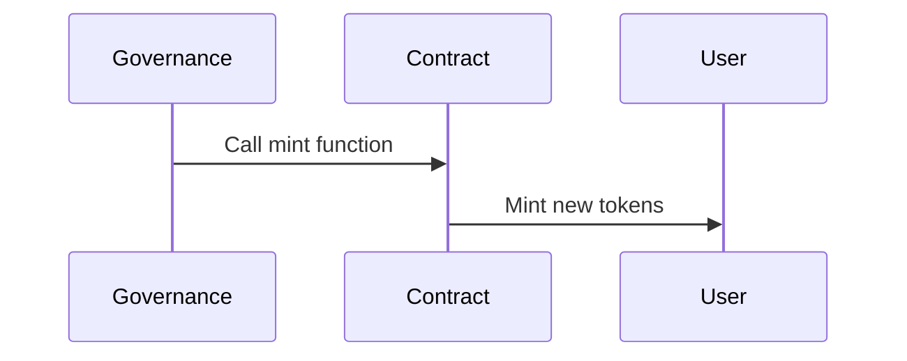

## Contract name

Short summary of the contract.

## Characteristics

- Needs to be called only by Governance

## Sequence Diagrams

1. Minting new tokens flow

```mermaid
sequenceDiagram
    participant A as Governance
    participant B as Contract
    participant C as User
    A->>B: Call mint function
    B->>C: Mint new tokens
```
